# 耦合PINN、正反问题、3D问题的学习研究

# 06-29

### 什么是PINN？

Raissi等人在2018年

 [Physics-informed neural networks: A deep learning
framework for solving forward and inverse problems involving
nonlinear partial differential equations](https://github.com/maziarraissi/PINNs)

中提出了PINN，通过在损耗函数中结合物理场（即偏微分方程）和边界条件来解决偏微分方程。损失函数是偏微分方程分布在域中的“搭配点”的均方误差和边界残差之和。

他们在文章中列出了数个经典pde算例来验证PINN的正确性。在他们的github主页上提供了源码，使用了Tensorflow1.x的框架。

截止到2022-06-29，TensorFlow更新到2.9，TensorFlow1.x代码风格跟TensorFlow2.x相差甚远，而且Raissi等人提供的代码也有许多值得优化的地方。

我在github上找到一个了PINN在TensorFlow2.x上的代码框架 [omniscientoctopus/Physics-Informed-Neural-Networks: Investigating PINNs (github.com)](https://github.com/omniscientoctopus/Physics-Informed-Neural-Networks),

### 本文研究什么？

利用暑假研究一下如下问题：

- PINN模型在耦合问题上的应用（这方面的研究似乎还不多），
- PINN正负问题求解（看了一些文章说PINN的优势其实在于 **高维问题 & 反问题求解**
- 使用tensorflow2.0，代码实现若干算例（也许可能maybe Only one😁），最好能把模型应用到3维。

### PINN模型搭建

> 工欲善其事必先利其器，先掌握TensorFlow，并使用TensorFlow自定义PINN模型是必要的。

先设想一个代码框架。

PINN的模型比较简单，如果先不考虑loss函数，那么PINN就是一个普通的全连接序列模型，可以用 **tf.keras.Sequential()**构建。

假设Layer = [inputs,n1,n2,...nk,n_outputs]，从左至右代表每层神经元的个数。

```python
def createModel(layer):
    if len(layer) < 2:
        print("层数小于2！, 无法构建神经网络")
        return 
    model = keras.Sequential(name = "PINN")
    model.add(keras.Input(shape=(layer[0],)))
    for i in range(1,len(layer)-1):
        model.add(layers.Dense(layer[i], activation="relu", name="layer{}".format(i)))
    model.add(layers.Dense(layer[-1], name="outputs"))
  
    #  model.compile( loss= , metrics = [], optimizer= )
    #	...
    #
    #
  
    return model
```

**`<font color='purple'>`后续要为 model 添加 loss（PINN主要部分）、metric（可以不要）、optimizer（优化器，必要）`</font>`**

> 以上内容于 2022 -  06 - 29  markdown。

---

# 06-30

### `<font color='blue'>`1.PINN模型搭建（续）`</font>`

TensorFlow为我们提供了多种多样的高阶API帮助我们快速搭建模型。**但是，快速方便的代价就是灵活性降低。**特别是PINN跟一般的机器学习模型训练步骤不同，主要来源于loss function需要对预测值进行求导运算。

今天的代码编写遭遇了一些困难，我昨天的构思实际上不可行：

1. 使用 **tf.keras.Sequential()**或者**tf.keras.Model()函数式API** 搭建模型 Model。(这一步没问题）
2. 编写自定义loss函数，然后将 自定义的loss & 优化器 & metrics 传入自带的方法 **Model.compile()**
3. 调用自带的方法 **Model.fit()** ，传入训练数据训练即可。

步骤1 和 （步骤2，步骤3）是相对独立的。而PINN模型结构简单，使用步骤1搭建模型完全没有问题。

问题出在（步骤2，步骤3）。

让我们先来看看其中两个关键的方法 **Model.compile() & Model.fit()** 方法究竟做了什么？

如果明白了Model.fit()的工作步骤，就会知道这种自带的训练方式局限性，以及为什么在训练PINN模型时，我们需要自定义训练过程。

**Model.fit()大致工作流程如下：**

```python
def fit(self,X_train,Y_train,epoches,batch_size,**kwargs):
    #
    #		主要的训练部分代码
    #
    for epoch in epoches: ## 使用 X_train,Y_train 进行 epoch 次训练
        for x_batch,y_batch in dataset(X_train,Y_train,batch_size): ## dataset(X_train,Y_train,batch_size) 数据分组
            train_step((x_batch,y_batch))  ## train_step(self,data) 是 类中的方法，可以重载，从而改变fit()

def train_step(self,data):
  
    # Unpack the data. Its structure depends on your model and on what you pass to `fit()`.
    x, y = data

    with tf.GradientTape(persistent=True) as tape:
        y_pred = self(x, training=True)  # Forward pass
        loss = self.compiled_loss(y, y_pred, regularization_losses=self.losses)
        #这里用到的 self.compiled_loss() 就是 Model.compile(loss) 传入的loss
        #即 Model.compile() 作用是让 self.compiled_loss = loss
                   
	# Compute gradients
    trainable_vars = self.trainable_variables
    gradients = tape.gradient(loss, trainable_vars)

    del tape

    # Update weights
    self.optimizer.apply_gradients(zip(gradients, trainable_vars))
  
    #指标计算（可选）
    #....
```

可以看到 **Model.fit()**只是为我们定义一个一般普通的训练步骤函数，并没有什么特殊。

**Model.fit()** 会在 train_step() 中调用 Model.compile() 传入的loss、优化器、指标。

```python
loss = self.compiled_loss(y, y_pred, regularization_losses=self.losses)
```

上述代码中compiled_loss()限定了参数 y , y_pred。y是标签值，y_pred是通过模型预测的值。

这也是为什么官方文档、网上的帖子说：

**如果想自定义loss，那么你自定义的loss函数一定要有两个输入参数（y，y_pred)。**

**因为在 fit() ——》train_step()中，调用了self.compiled_loss()，并规定了它的参入参数为（y,y_pred)**。

当然，我们可以重载 train_step() 使自定义loss函数自由度更高，并仍能使用fit()。

甚至重载fit()，但既然都重载fit()了，它等价于从0编写训练过程。——不过，这正是PINN训练需要的。

**因为我们有不同格式的训练数据（带标签和不带标签）、复杂的loss函数（不仅仅需要y，y_pred，还需要y_pred对x，t的导数），所以在这种情况下，仍然使用fit（）代码框架，需要大刀阔斧地修改。还不如自己写训练过程，不去使用所谓的高阶API~~**

### `<font color='blue'>`2.子类化Sequential() / Model() , 定义 MyPinn，自定义训练过程 `</font>`

之前讨论过**步骤1：使用Sequential搭建模型** 是没有问题的，我们需要做的仅仅是重新定义**训练过程**。

那么，子类化**class MyPinn(tf.keras.Sequential())**，MyPinn保留Sequential()好用的功能，再附加上我们自定义的**训练过程**

```python
class MyPinn(keras.Sequential): ## 以Burgers_Equation为例
    def __init__(self,name = None):
    
        super(MyPinn, self).__init__(name=name)
        self.nu = tf.constant(0.01/np.pi)
  
    @tf.function
    def test_gradient(self,X_f_train):
        x = X_f_train[:,0]
        t = X_f_train[:,1]
        with tf.GradientTape() as tape:
            tape.watch([x,t])
            X = tf.stack([x,t],axis=-1)
            u = self(X)
        u_x = tape.gradient(u,x)
        tf.print(u_x)
  
    @tf.function
    def loss_U(self,X_u_train,u_train):
        u_pred = self(X_u_train)
        loss_u = tf.reduce_mean(tf.square(u_train - u_pred))
        return loss_u
  
  
    @tf.function
    def loss_PDE(self,X_f_train):
        x = X_f_train[:,0]
        t = X_f_train[:,1]
        with tf.GradientTape(persistent=True) as tape:
            tape.watch([x,t])
            X = tf.stack([x,t],axis=-1)
            u = self(X)  
            u_x = tape.gradient(u,x)     
        
        u_t = tape.gradient(u, t)   
        u_xx = tape.gradient(u_x, x)
    
        del tape
    
        f = u_t + (self(X_f_train))*(u_x) - (self.nu)*u_xx

        loss_f = tf.reduce_mean(tf.square(f))

        return loss_f
  
  
    def loss_Total(self,X_u_train,u_train,X_f_train):
        loss_u = self.loss_U(X_u_train,u_train)
        loss_f = self.loss_PDE(X_f_train)
    
        loss_total = loss_u + loss_f
    
        return loss_total
  
    @tf.function
    def train_step(self,X_u_train,u_train,X_f_train):
        with tf.GradientTape(persistent=True) as tape:
            loss_total = self.loss_Total(X_u_train,u_train,X_f_train)
               
        trainable_vars = self.trainable_variables
        gradients = tape.gradient(loss_total, trainable_vars)
    
        del tape
    
        self.optimizer.apply_gradients(zip(gradients, trainable_vars))
        return loss_total
  
    def train_model(self, X_u_train,u_train,X_f_train, epochs=100):
        for epoch in tf.range(1,epochs+1):
            loss_total = self.train_step(X_u_train,u_train,X_f_train)
            if epoch % 10 == 0:            
                print(
                    "Training loss (for per 10 epoches) at epoch %d: %.4f"
                    % (epoch, float(loss_total))
                )
```

`<font color='purple'>` **在当前文件夹 myPINN.py 进行了train_model测试，成功运行** `</font>`

> 以上内容截止至 6-30 markdown

---

# 07-01

### `<font color='blue'>`优化器 `</font>`

tf.keras.optimizers为我们提供了许多现成的优化器，比如SGD（最速下降）、Adam、RMSprop等等。

假设，现有模型对象 MyPinn。

可以通过 tf.keras.optimizers.Optimizer() 创建优化器对象。例如， MyPinn.optimizer = tf.keras.optimizers.SGD()

tf.keras.optimizers.Optimizer()主要提供了两种Methods，为我们的参数进行优化。

1. **apply_gradients(**
   **grads_and_vars, name=None, experimental_aggregate_gradients=True**
   **)**

   之前定义的MyPinn.train_step()中就使用了这种Method。

   我们先计算出grads，再使用apply_gradient()，进行参数优化。
2. **minimize(**
   **loss, var_list, grad_loss=None, name=None, tape=None**
   **)**

   minimize()方法先使用tf.GradientTape()计算出loss，再调用apply_gradients()。相当于把compute gradients和apply gradients 封装在一起。

可以发现，apply_gradients()就是minimize()中的第二步。

**为了精准地控制优化过程，并在优化过程中加上一些别的操作，我们使用 第1种方法 对参数进行优化。**

### `<font color='blue'>`  Adam & L-BFGS `</font>`

Adam优化器在deep neural network中具有广泛的应用。之前也说过，tf.keras.optimizers里内置了Adam优化器，我们直接调用就好。

在PINN原作者的代码中(tensorflow1.x)，他们使用了两种优化器 ： Adam & L-BFGS。

在 training model 过程中，他们先使用 Adam 进行优化，后使用 L- BFGS 进行优化。

L-BFGS 是 秩2的拟牛顿方法(这学期 “最优化方法” 课上刚好学过)，它是基本牛顿方法的一种变形。牛顿方法在极值点附近时，收敛速度快，而拟牛顿方法在保持这个优秀性质的基础上，改进了牛顿方法过程的一些缺点，比如计算二阶导、矩阵求逆和G不正定等问题。

然而在TensorFlow1.x中 并没有内置的 L-BFGS，作者实际是使用tensoflow1.x 提供的一个接口，使用 Scipy 库中的 L-BFGS。

Scipy中调用L-BFGS的格式是：

```python
scipy.optimize.minimize(fun, 
				x0, args=(),
                method='L-BFGS-B', 
                jac=None, hess=None, hessp=None, bounds=None, constraints=(), tol=None, callback=None, options=None)
```

 其中fun是一个目标函数，返回目标函数值。

> ```
> fun(x, *args) -> float
> ```

where `x` **is a 1-D array with shape (n,)** and `args` is a tuple of the fixed parameters needed to completely specify the function.

> 当 jac = True 时， fun()  retrun fval , gradients

这时，再看一下作者调用L-BFGS的代码，就知道是什么意思了。。

```python
self.optimizer =tf.contrib.opt.ScipyOptimizerInterface (self.loss, 
                                                        method = 'L-BFGS-B', 
                                                        options = {'maxiter': 3000,
                                                                   'maxfun': 3000,
                                                                   'maxcor': 50,
                                                                   'maxls': 50,
                                                                   'ftol' : 1.0 * np.finfo(float).eps})
```

这时如果我们写 self.optimizer.minimize() 实际上就会调用 scipy.optimize.minimize( args ) ，args=上述代码中传入的参数，self.loss 相当于 fun。

遗憾的是，在TensorFlow2.x中，该接口已经删除。

当然我们仍能想办法使用Scipy中的L-BFGS，

无非就是按照scipy.optimize.miminze()的调用格式，在MyPinn内部定义一个loss_fun(x) ，x is 1-D array with shape = (n,)，

作为scipy.optimize.miminze(fun,...)中的fun，但这意味着需要把MyPinn的weights和bias "扁平化" 放在一个1维数组中，在优化完毕后，还要把结果再变成原来的形状，放回MyPinn里。

又但是，虽然接口没了，但TensorFlow2.0中 tfp 库中有实现 L-BFGS 算法。😁

**下面链接中，高赞回答讨论了在TensorFlow2.x中使用 Scipy的L-BFGS 和 自带的L-BFGS 计算差别。**

[python - Use Scipy Optimizer with Tensorflow 2.0 for Neural Network training - Stack Overflow](https://stackoverflow.com/questions/59029854/use-scipy-optimizer-with-tensorflow-2-0-for-neural-network-training)

``

**可以发现使用TensorFlow2.0 tfp中的L-BFGS计算速度更快**

**不过tfp中的L-BFGS计算结果略逊于Scipy中的L-BFGS，可能是TensorFlow默认float32，而Scipy是float64，以及Scipy中L-BFGS算法的实现比tfp的更好。**

[Optimize TensorFlow &amp; Keras models with L-BFGS from TensorFlow Probability | import pyChao](https://pychao.com/2019/11/02/optimize-tensorflow-keras-models-with-l-bfgs-from-tensorflow-probability/)

注意如果想使用tfp的L-BFGS也是要求输入变量是1-D的。而我们的PiNN模型中的weights和bias都是以多维的形式保存，所以要先将它们进行“扁平化”，再传入L-BFGS函数中。

上面的链接讨论了如何定义将model中的变量“扁平化”，变回来 以及 如何定义“function_factory"返回一个LBFGS需要的function。

我们看下tfp中L-BFGS的调用格式：

```python
tfp.optimizer.lbfgs_minimize(
    value_and_gradients_function,
    initial_position,
    num_correction_pairs=10,
    tolerance=1e-08,
    x_tolerance=0,
    f_relative_tolerance=0,
    initial_inverse_hessian_estimate=None,
    max_iterations=50,
    parallel_iterations=1,
    stopping_condition=None,
    name=None
)
# value_and_gradients_function 是一个函数, 
# Input: paramters with shape = 1-D ; Output: loss and gradients with paramters, gradients are also 1-D.

# initial_position: initial paramters 
```

<font color='purple' >**对MyPinn模型(keras.Sequential模型)使用tfp L-BFGS()进行参数优化流程如下：** </font>

1. 提取MyPinn中的weights 和 bias (即需要优化的parameters)，此时它们就是initial_position(未扁平化)。
2. 创建两个列表 idx=[],part=[]
3. 把MyPinn每层参数的shape等若干信息，用循环append到idx和part。

   idx帮助我们调用 tf.dynamic_stitch()将weights和bias"扁平化"成params_1d。

   part帮助我们params_1d变回weights和bias,并更新MyPinn中的参数。
4. 定义一个func函数,func(params_1d)

   Input:  params_1d

   Output: loss , gradients

   Inside：先把 params_1d 转变回 MyPinn 中 weights,bias 的shape，并更新它们。

   使用MyPinn中已定义的loss_Total()方法计算loss 和 gradients。

   注意：需要将 gradients 也扁平化 再return。( gradients.shape = [weights,bias].shape,故也可以用idx扁平化 )
5. 将第一步提取出来的weights 和 bias 扁平化处理，作为initial_position
6. 调用tfp.optimizer.lbfgs_minimize(func,initial_position)即可！

> 以上内容截止至 7-1 markdown

---

# 07-04

    今天主要添加了 Data Preparation 和 Plot 的代码。并且，按日期命名，将代码分开在不同的NoteBook。

    使用下面链接中的训练数据。

    [Optimize TensorFlow &amp; Keras models with L-BFGS from TensorFlow Probability | import pyChao](https://pychao.com/2019/11/02/optimize-tensorflow-keras-models-with-l-bfgs-from-tensorflow-probability/)

    不过，我在使用MyPinn训练Burgers Equation，训练结果不太理想。一开始，我怀疑是，float32格式**And** tfp中lbfgs与Scipy中lbfgs的差别。debug了很久，发现不是这些原因。

    因为上面的链接中，作者也有用tfp中的lbfgs训练模型，我运行了一遍，仍然可以达到很好的效果，看来还需要debug(恼。

    题外话，使用Google colab可以白嫖算力，将.ipynb文件上传，可以在云端计算，还免费，而且我的电脑内存有时候不太够用，所以colab就很nice。

> 以上内容截止至 7-4 markdown

---

# 07-05 Debug

今天花了不少时间，总算让我发现了这个所谓的“bug”。**“找bug时间，比写代码时间要长”这次真的印证了这句话吧。**

过程中，我甚至一度想要放弃自己的MyPinn模型，使用别人的构建模型代码（比如上面的链接） 。

**在解释bug之前**，我需要说明一下，为什么我自己要用构建一套TensorFlow2.x的Pinn class，而不是用别人的。

[Optimize TensorFlow &amp; Keras models with L-BFGS from TensorFlow Probability | import pyChao](https://pychao.com/2019/11/02/optimize-tensorflow-keras-models-with-l-bfgs-from-tensorflow-probability/)

**为方便说明，我将上述链接中的pinn代码称为 code**。

1. TensorFlow2.x默认是eager动态图模式，这种模式计算速度比较慢，但方便调试。使用@tf.function函数装饰器，能将 eager转为**AutoGraph动态图模式**计算，效率堪比TensorFlow1.x的静态图（tf1.x只支持静态图），同时也方便调试。**但是呢，@tf.function 有一定的编程规范。**

   而 **code**，没有使用TensorFlow2.0的@tf.function功能。

   这是原因一。
2. **高阶API**。tf.keras已经为我们提供了各种层、优化器、损失函数等 以及 **2种主要构建模型的方式**：Sequential()，函数式API。灵活使用函数式API，理论上可以构建任何模型，不单单是神经网络。而Pinn使用Sequential()即可。比如，我的代码就是让MyPinn继承keras.Sequential

   而在**code**中，Pinn继承的是keras.Module，Module实际上是Sequential等高阶API的基类，它提供的功能是记录在类中出现的Variables，而没有Sequential中更多好用方便的功能，比如直接使用add方法，搭配keras.layers.Dense，为MyPinn添加层(本质上也是添加Variables)。

   若使用**code**中的方法，让Pinn单单继承Module，则需要自己做变量初始化，并且没有别的好用的功能。它只能记录class中出现的变量而已。

   这是原因二。
3. **优化器**。在code中为了使用LBFGS，在类中定义了 “变量一维化、一维变量转为原来形状”等 专门为使用LBFGS的函数。我不喜欢这样子。

   **为了清晰性，我更倾向于将模型定义和优化方法分离开，而不是全在写在class中。**

   “变量一维化、一维变量转为原来形状”这样的函数，只是为使用LBFGS服务的，他应该定义在外面。如果使用内置的Adam、SDG等优化器，完全不需要定义这些函数，直接在train_step()中，optimizer.apply_gradient（）即可。

   这是原因三。

所以bug出现在哪呢？@tf.function 编程不规范？ 变量名写错？

**在loss_PDE的定义中。**

下面我分别给出我自己的定义以及code的定义

```python
def loss_PDE(self,X_f_train): #我的定义
  
      x = X_f_train[:,0]  # x.shape =(nums,)
      t = X_f_train[:,1]  # t.shape =(nums,)
      with tf.GradientTape(persistent=True) as tape:
          tape.watch([x,t])
          X = tf.stack([x,t],axis=-1) # X.shape = (nums,2)
          u = self(X)  # predict u
          u_x = tape.gradient(u,x)
```

```python
def loss_PDE(self,X_f_train): #code的定义
  
      x = X_f_train[:,0:1] # x.shape = (nums,2)
      t = X_f_train[:,1:2] # t.shape = (nums,2)
      with tf.GradientTape(persistent=True) as tape:
          tape.watch([x,t])
          X = tf.stack([x[:,0],t[:,0]],axis=1) #X.shape = (nums,2)
          u = self(X)  # predict u
          u_x = tape.gradient(u,x)
```

两种代码的第3行和第4行，干的都是同一件事，把X_f_train的 x 和 t 分离出来（后面要对x，t求导）。

```python
with tf.GradientTape(persistent=True) as tape:
	....
```

上述将计算过程记录在“tape”中，后面可以求tape中出现变量（包括中间变量）的导数。

tape.watch([x,t])将x，t也记录到tape中，因为默认只记录variables，而此处x和f是constant。

我们将x,t通过tf.stack()拼接到一起组成模型的input：X，调用self(X) predict u。tf.stack也会被看做一种算子，被记录到tape中。

你或许发现X和loss_PDE函数传入的X_f_train**数值上一样**，为什么不直接self(X_f_trian)呢？**因为它仅仅是数值上一样。。。**

可以试一下改用u=self(X_f_train)，那么u_x返回的None。

令人我感到奇怪的是，两种代码的第7步，最后返回的X是一样的，为什么只有第二种（code的实现）OK？而我的就不行。

其实我在写代码的时候，参考了code的loss_PDE，觉得他的操作有点**多余**，就用了一种更清楚的写法，正如第一种写法那样，然而训练的结果就是，第一种不行！？

**下面我再验证一下两种写法的(第7行)X是否一致?**


结果显示 g 和 gg ，确实是一样的（全是True，没有截完全)，令人疑惑。

**不管了。后面我使用了code的写法.模型的loss函数能不断下降了，效果见7_4-7_5MyPINN_Burgers.ipynb**

> 以上内容截止至 7-5 markdown

---

# 07-06

今天阅读学习了一些NN在PDE求解问题中的多种方法。

### 神经网络常见结构


**目前PINN大多为全连接前向网络(tensorflow中的Dense层)，尝试使用如卷积层、循环网络、反馈网络？**

### 神经网络对边界条件的处理方式

ANN: artificial neural network

1. **纯网络型**
2. 1  Loss = $\lambda_1 * MSE_{pde} + \lambda_2 * MSE_{BC}$  ， 原始的PINN模型就使用的是这种方式，利用边界条件和预测值计算$MSE_{BC}$,纳入loss中。
3. 2  将边界条件带入神经网络表达式——取代部分weights，通过微分方程残差$MSE_{pde}$优化剩余权值。如下图所示：


    **但我认为，对于某一个复杂pde，代码实现这种思想并不容易。**

2. **边界吸收型**

   边界吸收型的思想是：把神经网络看做函数 ANN(X)；构造边界函数BC(X)：当X∈边界时，BC为边界值，否则为0；构造 L(X)，当X∈边界时，L(X)=0.

令试解  $y_t = BC(X) + L(X) * ANN(X) $, 此函数严格满足边界条件。再通过域内点计算$MSE_{pde}$，更新ANN。

    **BC(X),L(X)的构造方法：**

    ``


**在PDE中如何解释ANN(X)的作用？** 通用BC(X),L(X)的构造方法？

进一步，使用独立网络$ANN_{BC}$代替BC(X)。


有了这种独立网络的思想，也有人提出多网络的模型。即用独立的网络分别预测PDE中的各种偏导，最后把loss加在一起。

---

# 07-07

今天主要阅读学习了张学长的论文，关于使用PINN求解Navier-Stokes/Darcy耦合模型的正反问题。

## 正问题与反问题

正问题：

已知pde方程组，初边值条件，求解析解或者数值解。

反问题：

已知pde方程组，或不知道初边值条件，或不知道模型中某些参数的值，取而代之，知道区域内部的一些数值真解，反推整个区域的解或者模型参数。

---

## 求解思路

**对于正问题：**

构建两个独立的神经网络$NN_1 和 NN_2$，但是他们的输入层input是相同的，$NN_1$用于求解Naiver-Stokes方程$U_1$，$NN_2$用于求解$U_2$,根据Navier-Stokes/Darcy耦合模型中的pde方程和初边值条件，用$U_1 和 U_2$构造残差，加在一起，组成loss。训练神经网络。

**对于反问题：**

假设，初边值条件未知，但知道一些内部区域的数值解。只需要把loss中的初边值MSE去掉，改成关于内部区域的数值值的MSE。其实在PINN中，初边值和内部区域的数值解 可以看做是同等低位的。

假设，方程组中某些物理参数值未知。只需要把它们设置为Variables，纳入loss，与NN的参数一起训练。

不得不说，Native-stokes/Darcy耦合模型的方程组还是比较复杂的，张学长的论文中，使用2d具有解析解的算例，使用最原始的PINN模型结构求解，效果还算不错。

但当问题变成3d，loss更加复杂时，并且还有一个问题，由于高阶导数的存在，使用这种最原始的PINN模型解Navier-Stokes/Darcy耦合模型，应该很慢。

从NN的模型结构和训练策略上做一些调整，应该算是比较自然的优化策略。

---

# 07-08

## 小批量训练模式实验

    阅读一篇论文，关于pde耦合模型的数值求解方法。

    PARTITIONED TIMESTEPPING FOR A PARABOLIC TWO DOMA.pdf

    试了下小批量训练。将全部训练数据**n等分后**，进行小批量训练。在相同的epochs下，小批量训练效果比原来好。效果见"7_8_myPINN_Burgers.ipynb"

---

# 07-11

## PINN求解parabolic耦合pde模型

    用PINN求解最简单的parabolic耦合pde模型——PARTITIONED TIMESTEPPING FOR A PARABOLIC TWO DOMA.pdf


模型定义和训练模型的代码写好了，画图的还没写。训练数据的生成代码，写的有些冗长，后面会优化一下。

代码见 **7_11_Parabolic耦合pde模型.ipynb**

**网络结构:**

两个独立的神经网络$NN_1 , NN_2$，分别用于预测$u_1,u_2$, 构造 $ loss = loss_{u1} + loss_{u2} + loss_{interface}$，每次训练同时训练两个网络，耦合性体现在$loss_{interface}$.


每次训练模型，$NN_1 和 NN_2 $各自传入一批"不同的" 内部点训练集 和 边界点训练集(不包括interface)。 $NN_f和NN_p$在interface处的训练集。

---

# 07-12

## 训练parabolic耦合pde的PINN模型

    u1拟合的比较好。u2拟合效果很差，特别是在边界处。

    正在研究，不知是代码有错，还是说因为u2表达式比较复杂，有y的二次项。

    训练代码见**7_11_Parabolic耦合pde模型.ipynb**

---

# 07-13

## **与2位学长会议交流，讨论PINN**

解决了不少疑问，PINN在边界处的拟合效果确实一般。

``

---

# 07-15—07-17

## **改进parabolic耦合pde的代码。**

改进方案如下：

1. 与同学讨论发现，之前的采样点为等分，不够“随机”，使用normal或者拉丁高次方采样效果更好
2. 训练次数不足，增加训练次数
3. 将边界点也同时纳入内部点训练，导致在较少训练次数下，边界处效果不好
4. 耦合阶段训练结束后，继续对两个区域分布进行单独的PINN训练，使得精准度进一步提升

效果见 **7_15_改进版Parabolic耦合pde.ipynb**

---

# 07-18

## 代码 & 论文阅读

    学习TensorFlow2.0 Metric评估函数 ，代码见“**tensorflow学习记录/12_Metric.ipynb**”

    阅读 [Deep Learning-An Introduction](../论文资料/Deep Learning-An Introduction.pdf )。这篇文章从数学角度，从零开始介绍Deep Learning，是一篇介绍性的文章。

---

# 07-20

## Self-Adaptive-Weight c-PINN

**今天对parabolic耦合pde的PINN模型进一步改进**。主要有如下两个方面：

1. 预训练模式
2. 自适应loss函数因子

**预训练模式**：在训练耦合模型前，先各种单区域进行PINN训练。有利于耦合模型边界训练，以及训练效率。

**自适应loss函数因子：**

$$
Loss = \alpha_1 * loss_{u1} + \alpha_2 * loss_{u2} \\
loss_{u1} := loss_{u1}^{bc} + loss_{u1}^{f} + loss_{u1}^{i} \\
loss_{u2} := loss_{u2}^{bc} + loss_{u2}^{f} + loss_{u2}^{i} \\
$$

    其中$\alpha_i$就是自适应因子。

    考虑到实际训练过程中，u1和u2的loss大小不一样，**”优先“**训练loss较大的一方，即在$loss_{ui}$前乘上一个较大的因子，使其在整个**$Loss$**中占比更大，从而达到优先训练的目标。

### **什么是自适应权重 Self-Adaptive-Weight？**

    把$\alpha_1,\alpha_2$也看做变量。在训练模型参数的过程中，我们使用的梯度下降算法，是基于“负梯度”。

    如果使用**“正梯度”**去改变$\alpha_1,\alpha_2$，能够使得$loss_{ui}$对应的$\alpha_{i}$更大。

    实际上，使用这种策略，不断地训练会使得$\alpha$一直增大，同时为了控制$\alpha$的值，可以套一层sigmoid函数，使得$\alpha$控制在0-1之间。$初始化\alpha=0，\alpha=tf.math.sigmoid(\alpha)$,

### 加权策略

    对$loss_{u1} 和 loss_{u2}$ 加权的**目的**：使得损失较大的一方在整个loss中的贡献更大，使得神经网络倾向于训练损失更大的一方。

    值得注意的是，如果两个神经网络之间没有联系，即$loss_{u1}(x_1;\theta_1) , loss_{u2}(x_2;\theta_2) $的自变量$(x_1,\theta_1),(x_2,\theta_2)$之间没有重合的部分，那么对$loss_{u1} 和 loss_{u2}$ 加权实际上是没有"效果"的。

    原因是，如果两个神经网络之间没有联系时，那么我们对$Loss = \alpha_1 * loss_{u1} + \alpha_2 * loss_{u2}$求关于$\theta_{1}$的导数，$\frac{\partial loss}{\partial \theta_1} =\alpha_1 *  \frac{\partial loss_{u1}}{\partial \theta_1}$，可以发现与$\theta_2$无关，即跟第二个神经网络无关，只是在训练单个神经网络而已，而对单个神经网络的loss乘以一个数，实际是没有用的，相当于对优化问题中目标函数乘上一个常数，显然不影响我们寻找最优解。

    因此，此处的$loss_{u1},loss_{u2}$具体为：

$$
loss_{u1} := loss_{u1}^{bc} + loss_{u1}^{f} + loss_{u1}^{i} \\
loss_{u2} := loss_{u2}^{bc} + loss_{u2}^{f} + loss_{u2}^{i} \\
$$

其中$loss_{u1}^{i}$是u1在交界处Interface 的损失函数，与u1,u2有关，即与$\theta_{1},\theta_{2}$有关，它使得两个神经网络联系在一起。当$loss_{u1}^{i}$权重更大时，模型通过梯度下降更新两个网络的参数$\theta_{1},\theta_{2}$,会更倾向于使得$loss_{u1}$更小。

在实际操作中，无论是单区域的PINN和耦合的PINN，在边界处的拟合效果相较于内部的拟合效果更差。

往往在$loss_u^{bc}$前乘上一个常数k，比如k=10：

$$
Loss = \alpha_1 * loss_{u1} + \alpha_2 * loss_{u2} \\
loss_{u1} := 10* loss_{u1}^{bc} + loss_{u1}^{f} + loss_{u1}^{i} \\
loss_{u2} := 10* loss_{u2}^{bc} + loss_{u2}^{f} + loss_{u2}^{i} \\
$$

### 多种自适应加权策略

除了那种自适应权重 Self-Adaptive-Weight之外，我还构造了一种新的。

令:

$$
Loss^{(k)} = loss_{u1}^{(k)} + \alpha^{(k)} loss_{u2}^{(k)} ,\alpha^{(0)} = 1 \\

 \alpha^{(k+1)} = \frac{loss_{u2}^{(k)} }{loss_{u1}^{(k)} + eps}, 其中 eps是一个很小的正数，防止分母为0\\
$$

想法就是，当前步的权重$\alpha^{(k)}$是根据上一步$loss_{u1}^{(k-1)},loss_{u2}^{(k-1)}$的比值来调整,当$\alpha^{(k)}$>1时，表示上一步loss_u2的值更大，故在当前步，让loss_u2乘上$a^{(k)}>1$,使得当前步loss_u2下降得更快。

这种”自适应“策略有很多，想怎么构造就怎么构造，要抓的点就是根据以前的loss，动态地调整权重，使得当前步倾向训练于前N步中较大的 **子loss** 。

---

# 07-21

## 优化训练步骤

1. 预训练——单区域训练
2. 耦合训练——Adam算法
3. 耦合训练——LBFGS算法

**代码见0721_自适应&LBFGS_Parabolic耦合模型.ipynb** `<br />`比较Adam算法和LBFGS算法的训练表现。`<br />`（有必要深入了解Adam的性质，在训练后期表现远不如LBFGS）

# 07-22

## 区域反问题

    流体力学领域还存在各种各样的反问题，比如物理模型的初边值 条件是未知的，取而代之的是已知内部部分区域或部分物理量的数值真解，以此 反推整个区域的流体运动情况；或者，物理模型的方程本身具有一些未知参数， 需要通过真实的数值结果进行反推。这类问题在工程应用中具有很大意义，然而 各种传统方法对此类问题的求解具有一定的难度，在本文神经网络求解的框架 下，却很容易对该类反问题尝试进行求解。

    使用之前的Parabolic 耦合PDE模型进行区域反问题的实验。

对**区域1{(x,y)|0<=x<=1,0<=y<=1}**的划分为：

    regions_x = [ [0.10,0.30],[0.40,0.60],[0.70,0.90] ]

    regions_y = [ [0.10,0.30],[0.40,0.60],[0.70,0.90] ]

对**区域2{(x,y)|0<=x<=1,-1<=y<=0}**的划分为：

    regions_x = [ [0.10,0.30],[0.40,0.60],[0.70,0.90] ]

    regions_y = [ [-0.10,-0.30],[-0.40,-0.60],[-0.70,-0.90] ]

3 * 3 = 9，每个区域被分为9个子区域

**将原来边界处的X_u_train,u_train替换会这些子区域内的点和对应的解。**

> 区域的划分有讲究，若区域过于小或者覆盖率低等，可能导致整个区域内拟合效果和真解差距大，解可能不唯一。

代码见 **0722_区域反问题 Parabolic耦合模型.ipynb**

---

# 07-23

## 参数反问题

    参数反问题是指已知部分、乃至全部数值真解，反推模型的参数，以传统方法来说，这是很困难的，但在PINN框架下，只需要将模型参数设为变量，带入真解训练模型（同时训练参数），可以反推参数。

代码见 **0723_参数反问题_Parabolic耦合模型.ipynb**

---

# 07-26

## 3d 算例& n-d 算例

> *之前所有的代码都是基于如下的模型和算例*，可以看到是2d的，即u(x,y,t)。

### **parabolic 耦合PDE模型**

 In this work, a simplified model of diffusion through two adjacent materials which are coupled across their shared and rigid interface $I$ through a jump condition is considered. This problem captures some of the time-stepping difficulties of the ocean-atmosphere problem described in 1.2. The domain consists of two subdomains $\Omega_{1}$ and $\Omega_{2}$ coupled across an interface $I$ (example in Figure $1.1$ below). The problem is: given $\nu_{i}>0, f_{i}:[0, T] \rightarrow H^{1}\left(\Omega_{i}\right), u_{i}(0) \in$ $H^{1}\left(\Omega_{i}\right)$ and $\kappa \in \mathbb{R}$, find (for $\left.i=1,2\right) u_{i}: \bar{\Omega}_{i} \times[0, T] \rightarrow \mathbb{R}$ satisfying

$$
\begin{aligned}
u_{i, t}-\nu_{i} \Delta u_{i} &=f_{i}, \quad \text { in } \Omega_{i}, &(1.1)\\
-\nu_{i} \nabla u_{i} \cdot \hat{n}_{i} &=\kappa\left(u_{i}-u_{j}\right), \quad \text { on } I, \quad i, j=1,2, i \neq j, &(1.2)\\
u_{i}(x, 0) &=u_{i}^{0}(x), \quad \text { in } \Omega_{i}, &(1.3)\\
u_{i} &=g_{i}, \quad \text { on } \Gamma_{i}=\partial \Omega_{i} \backslash I . &(1.4)
\end{aligned}
$$

### **2d算例**

Assume $\Omega_{1}=[0,1] \times[0,1]$ and $\Omega_{2}=[0,1] \times[-1,0]$, so $I$ is the portion of the $x$-axis from 0 to 1 . Then $\mathbf{n}_{1}=[0,-1]^{T}$ and $\mathbf{n}_{2}=[0,1]^{T}$. For $a, \nu_{1}, \nu_{2}$, and $\kappa$ all arbitrary positive constants, the right hand side function $\mathbf{f}$ is chosen to ensure that

$$
\begin{aligned}
&u_{1}(t, x, y)=a x(1-x)(1-y) e^{-t} \\
&u_{2}(t, x, y)=a x(1-x)\left(c_{1}+c_{2} y+c_{3} y^{2}\right) e^{-t} .
\end{aligned}
$$

The constants $c_{1}, c_{2}, c_{3}$ are determined from the interface conditions (1.2) and the boundary conditions for $u_{2}$. One may verify that with the following choices for $c_{1}, c_{2}, c_{3}, u_{1}$ and $u_{2}$ will satisfy (1.1)-(1.4) with $g_{1}=g_{2}=0$, i. e. when $x \in\{0,1\}$ or $y \in\{-1,1\}$ :

$$
c_{1}=1+\frac{\nu_{1}}{\kappa}, c_{2}=\frac{-\nu_{1}}{\nu_{2}}, c_{3}=c_{2}-c_{1} .
$$

The numerical analysis performed in Section 4 indicates that by choosing $\kappa$ to be no larger than $\nu_{1}, \nu_{2}$ the IMEX scheme should perform as well as the implicit scheme. Computational results comparing the performance of the two methods are listed for two test problems:

- Test Problem 1: $a=\nu_{1}=\nu_{2}=\kappa=1$.

 实际上 `u1` 和 `u2`的构造是基于令$u_{i} =g_{i} =0, \quad \text { on } \Gamma_{i}=\partial \Omega_{i} \backslash I$, 你会发现在边界上u1 = 0 。

再根据(1.2)和(1.4)推出u2中参数需要满足的关系式。最后在根据(1.1)求出f1和f2。确定参数的值，最终构成一个完整的算例。

> 下面我将算例拓展到3d，实际上可以推广到 n-d。

### 3d算例

Assume $\Omega_{1}=[0,1] \times[0,1] \times[0,1]$ and $\Omega_{2}=[0,1] \times[0,1]\times[-1,0]$, so $I$ is the plain of z=0 , the $x$-axis from 0 to 1 ,the $y$-axis from 0 to 1.Namely.  $I$ = $[0,1] \times[0,1] \times\{0\}$ .

Then $\mathbf{n}_{1}=[0,0,-1]^{T}$ and $\mathbf{n}_{2}=[0,0,1]^{T}$.

For $a, \nu_{1}, \nu_{2}$, and $\kappa$ all arbitrary positive constants, the right hand side function $\mathbf{f}$ is chosen to ensure that

$$
\begin{aligned}
&u_{1}(t, x, y, z)=a xy(1-x)(1-y)(1-z) e^{-t} \\
&u_{2}(t, x, y, z)=a xy(1-x)(1-y)\left(c_{1}+c_{2} z+c_{3} z^{2}\right) e^{-t} .
\end{aligned}
$$

The constants $c_{1}, c_{2}, c_{3}$ are determined from the interface conditions (1.2) and the boundary conditions for $u_{2}$. One may verify that with the following choices for $c_{1}, c_{2}, c_{3}, u_{1}$ and $u_{2}$ will satisfy (1.1)-(1.4) with $g_{1}=g_{2}=0$, i. e. when $(x,y,z) \in\{x=1,0\leq y \leq 1,0\leq z \leq 1\}, u_1(x,y,z,t) = 0$ :

$$
c_{1}=1+\frac{\nu_{1}}{\kappa}, c_{2}=\frac{-\nu_{1}}{\nu_{2}}, c_{3}=c_{2}-c_{1}.
$$

The numerical analysis performed in Section 4 indicates that by choosing $\kappa$ to be no larger than $\nu_{1}, \nu_{2}$ the IMEX scheme should perform as well as the implicit scheme. Computational results comparing the performance of the two methods are listed for two test problems:

- Test Problem 1: $a=\nu_{1}=\nu_{2}=\kappa=1$.

### n-d 算例

$\Omega_{1}=\underbrace{[0,1] \times... \times[0,1] }_{n-1}\times[0,1]$,$\Omega_{2}=\underbrace{[0,1] \times... \times[0,1] }_{n-1}\times[-1,0]$,  $I$ = $\underbrace{[0,1] \times... \times[0,1] }_{n-1}\times\{0\}$ .

Then $\mathbf{n}_{1}=\underbrace{[0,...,0}_{n-1},-1]^{T}$ and $\mathbf{n}_{2}=\underbrace{[0,...,0}_{n-1},1]^{T}$.

For $a, \nu_{1}, \nu_{2}$, and $\kappa$ all arbitrary positive constants, the right hand side function $\mathbf{f}$ is chosen to ensure that

$$
\begin{aligned}&u_{1}(t, x_1, x_2, ...,x_n)=ae^{-t} \prod \limits_{i=1}^n
x_i(1-x_i)  \\
&u_{2}(t, x_1, x_2, ...,x_n)=ae^{-t} \left(c_{1}+c_{2} x_n+c_{3} x_n^{2}\right)\prod \limits_{i=1}^{n-1}
x_i(1-x_i) .
\end{aligned}
$$

The constants $c_{1}, c_{2}, c_{3}$ are determined from the interface conditions (1.2) and the boundary conditions for $u_{2}$. One may verify that with the following choices for $c_{1}, c_{2}, c_{3}, u_{1}$ and $u_{2}$ will satisfy (1.1)-(1.4) with $g_{1}=g_{2}=0$:

$$
c_{1}=1+\frac{\nu_{1}}{\kappa}, c_{2}=\frac{-\nu_{1}}{\nu_{2}}, c_{3}=c_{2}-c_{1} .c_{1}=1+\frac{\nu_{1}}{\kappa}, c_{2}=\frac{-\nu_{1}}{\nu_{2}}, c_{3}=c_{2}-c_{1} .
$$

---

## DeepXDE库&TensorDiffEq库

DeepXDE&TensorDiffEq是现有的PINN求解器。

- [DeepXDE(官方文档)](https://deepxde.readthedocs.io/en/latest/)，布朗大学 Lu 博士开发的，就是 DeepONet 那位 Lu 博士。他们组是本次 PINN 潮流的先驱，应该算是第一款也是“官方”的 PINN 求解器。集成了基于残差的自适应细化（RAR），这是一种在训练阶段优化残差点分布的策略，即在偏微分方程残差较大的位置添加更多点。还支持基于构造实体几何 （CSG） 技术的复杂几何区域定义。

> [DeepXDE论文](../论文资料/DeepXDE- A Deep Learning Library for Solving Differential Equations.pdf)

- [TensorDiffEq(官方文档)](https://docs.tensordiffeq.io/)看名字就知道是基于 Tensorflow，特点是做分布式计算。主旨是通过可伸缩（scalable）计算框架来求解 PINN，明显是为大规模工业应用做铺垫。

---

# 07-27

## 3D-parabolic代码编写

    在2d基础上新增一个维度即可，即在神经网络的输入Input层新增一个维度and增加对z的偏导。注意训练数据的生成以及图像生成需要略微改动。

    实验效果见**0727_3D_Parabolic耦合模型.ipynb**

> 因为增加一个维度，训练的难度有所上升，
>
> - 增加一些 hidden layers 以及 hidden size。
> - 增加区域内采样点N_f的数量，和初边值条件的训练点。

# 07-30

## 3D-parabolic代码优化

在原先代码的基础上，为CouplePinn的model增加了若干Metrics指标
：loss，loss_u1,loss_u2,loss_i,error_u1,error_u2。

在每次epoch结束，都会打印这些指标的值，loss类指标反应了损失函数的变化，error类指标反应了测试集的错误率，即真实解与模型得出的解之间的差距。

代码见 `0730_3D_Parabolic耦合模型_优化.ipynb`，拟合效果还是不错的。

此外，上述提到的指标有助于我们分析模型在训练中情况，帮助我们诊断训练结果的好坏。具体来说，有以下准则：

设 loss：训练集的损失值，error：测试集的错误率

- 情况一：loss不断下降，error不断下降，说明**模型仍在学习中**
  - 解决办法：此时模型是最好的，不需要其他措施
- 情况二：loss不断下降，error保持不断，说明**模型出现过拟合**
  - 解决办法：采用数据增强(训练集N_u,N_f数量增大)，正则化等
- 情况三：loss趋于不变，error不断下降，说明**训练数据集100%有问题**
  - 解决办法：检查dataset
- 情况四：loss趋于不变，error趋于不变，说明**学习遇到瓶颈或收敛(error已经很低)**
  - 解决办法：减少学习率or增大batch_size(即减少批量总数)or停止训练

---

# 08-01

## [Effective Tensorflow2(上)](https://www.tensorflow.org/guide/effective_tf2)

    学习TensorFlow官网的**Effective Tensorflow2** 文档，
    高效地使用TensorFlow2搭建以及训练模型。

## Overview

This guide provides a list of best practices for writing code using TensorFlow 2 (TF2)

## 如何更好使用 TensorFlow2

### **1.重构代码:更多的子模块**

A good practice is to refactor your code into smaller functions that are called as needed. For best performance, you should try to decorate the largest blocks of computation that you can in a tf.function (note that the nested python functions called by a tf.function do not require their own separate decorations, unless you want to use different jit_compile settings for the tf.function). Depending on your use case, this could be multiple training steps or even your whole training loop. For inference use cases, it might be a single model forward pass.

使用 `@tf.function`装饰器 包装函数，特别对于大型计算类函数，比如向前传播 `Forward Pass`, 单步训练 `training by step`。

在TensorFlow2中，默认动态图Eager模式，使用 `@tf.function`装饰函数后，能使得该函数内的计算转为AutoGraph模式。

简单的理解就是，函数被@tf.function后，每次调用它，都是从内存中取出该函数的计算图，而不是Eager模型下再次动态构建计算图。@tf.function能够提高计算效率，特别是对于大型计算。

---

### **2.调节优化器Optimizer的默认学习率**

TensorFlow的内置优化器集成在tf.keras.optimizers中，比如SDG、Adam、Nadam、RMSprop等。

在TF2中，部分Keras的优化器有不同的默认学习率。如果发现模型的收敛表现不同，记得check优化器的默认学习率。

SDG，Adam，RMSprop的默认学习率是一致的。

The following default learning rates have changed:

- optimizers.Adagrad from `0.01` to `0.001`
- optimizers.Adadelta from `1.0` to `0.001`
- optimizers.Adamax from `0.002` to `0.001`
- optimizers.Nadam from `0.002` to `0.001`

---

### **3.继承tf.Module以及使用Keras.layers管理Variables**

`tf.Module`和 `tf.keras.layers.Layer`含有两种好用的属性 `variables` and `trainable_variables`,它们递归地收集了模型中所有的变量。

This makes it easy to manage variables locally to where they are being used.

Keras layers/models 继承 `tf.train.Checkpointable` 子类 并与 `@tf.function`相融合,这使得我们能够直接保存checkpoint或者从Keras Objects中导出模型计算图。

---

### **4. 结合tf.data.Dataset 和 @tf.function**

`tf.data.Dataset`也叫数据管道。当训练数据量太多时，内存容量不足以支持将数据全部放入内存中并开始训练。数据管道的作用就是每次训练都从外存中拿一部分数据进来训练。

Tensorflow Datesets(tfds) 包，提供了许多utilities，我们可以通过tf.data.Dataset的Object 加载predefined的数据集。

例如，使用tfds加载MNIST数据集：

```python
datasets, info = tfds.load(name='mnist', with_info=True, as_supervised=True)
mnist_train, mnist_test = datasets['train'], datasets['test']
```

接着预处理数据，做成训练数据：

```python
BUFFER_SIZE = 10 # Use a much larger value for real code
BATCH_SIZE = 64
NUM_EPOCHS = 5


def scale(image, label):
  image = tf.cast(image, tf.float32)
  image /= 255

  return image, label
```

```python
train_data = mnist_train.map(scale).shuffle(BUFFER_SIZE).batch(BATCH_SIZE)
test_data = mnist_test.map(scale).batch(BATCH_SIZE)

STEPS_PER_EPOCH = 5

train_data = train_data.take(STEPS_PER_EPOCH)
test_data = test_data.take(STEPS_PER_EPOCH)
```

```python
image_batch, label_batch = next(iter(train_data))
# 这里 next,iter都是python内置的迭代器方法，用于取出一个元素
```

Use regular Python iteration to iterate over training data that fits in memory. Otherwise, tf.data.Dataset is the best way to stream training data from disk. Datasets are iterables (not iterators), and work just like other Python iterables in eager execution. You can fully utilize dataset async prefetching/streaming features by wrapping your code in tf.function, which replaces Python iteration with the equivalent graph operations using AutoGraph.

```python
@tf.function
def train(model, dataset, optimizer):
  for x, y in dataset: #从dataset中解包出 x，y
    with tf.GradientTape() as tape:
      # training=True is only needed if there are layers with different
      # behavior during training versus inference (e.g. Dropout).
      prediction = model(x, training=True)
      loss = loss_fn(prediction, y)
    gradients = tape.gradient(loss, model.trainable_variables)
    optimizer.apply_gradients(zip(gradients, model.trainable_variables))
```

如果使用Model内置的fit方法，更加方便，都不用考虑dataset的迭代。

> fit是训练模型的函数，高阶API，程序员已经帮我们写好了一种一般化的训练步骤，只需要指定训练数据，优化器等模型配置即可开始训练，不用自己编写训练代码.

```python
model.compile(optimizer=optimizer, loss=loss_fn)
model.fit(dataset)
```

---

### **5.使用Keras内置的训练loop**

当我们不需要对训练过程进行底层的控制，那么就使用Keras的 bulit-in 方法吧，比如 fit，evaluate和predict。

- fit：训练模型
- evaluate：评估模型
- predict：预测/推理

使用这些方法，包括但不限于如下优势：

- 简单，傻瓜式
- 支持 Numpy arrays, Python generators 和 `tf.data.Datasets`.
- 自动使用 regularization 和 激活函数
- 支持任意的callables作为 losses and metrics.
- 支持 callbacks(回调函数) like tf.keras.callbacks.TensorBoard以及自定义回调函数。
- 高性能，自动使用 TensorFlow graphs.

可以发现上述方法支持的功能非常多，只需要传入相应的参数，这些功能的具体实现都不需要自己写。

当然，如果模型训练过程乃至推断过程都比较复杂，需要对训练过程进行底层的控制，则需要自定义以及重写方法。

fit()方法是会调用train_step()方法，即每一步的训练过程。
fit大致结构是：

```python
def fit(ds,epochs,*args,**kwargs):
    ...
    for epoch in tf.range(epochs):
        ...
        for data in ds:
            self.train_step(data)
        ...
    ...
    '''
    每次epoch开始/结束，会计算Metric指标(如果传入)，
    以及回调函数(如果传入)等。但训练的核心是train_step()函数。

    往往来说，我们可以只重载train_step()达到底层控制的目的，
    同时还能继续使用fit()中好用的功能。像搭积木一样。
    '''
```

下面展示一个使用 `Dataset`训练模型的例子：

```python
model = tf.keras.Sequential([
    tf.keras.layers.Conv2D(32, 3, activation='relu',
                           kernel_regularizer=tf.keras.regularizers.l2(0.02),
                           input_shape=(28, 28, 1)),
    tf.keras.layers.MaxPooling2D(),
    tf.keras.layers.Flatten(),
    tf.keras.layers.Dropout(0.1),
    tf.keras.layers.Dense(64, activation='relu'),
    tf.keras.layers.BatchNormalization(),
    tf.keras.layers.Dense(10)
])

# Model is the full model w/o custom layers
model.compile(optimizer='adam',
              loss=tf.keras.losses.SparseCategoricalCrossentropy(from_logits=True),
              metrics=['accuracy'])

model.fit(train_data, epochs=NUM_EPOCHS)
loss, acc = model.evaluate(test_data)

print("Loss {}, Accuracy {}".format(loss, acc))
```

```Plain
Epoch 1/5
5/5 [==============================] - 9s 7ms/step - loss: 1.5762 - accuracy: 0.4938
Epoch 2/5
5/5 [==============================] - 0s 6ms/step - loss: 0.5087 - accuracy: 0.8969
Epoch 3/5
5/5 [==============================] - 2s 5ms/step - loss: 0.3348 - accuracy: 0.9469
Epoch 4/5
5/5 [==============================] - 0s 5ms/step - loss: 0.2445 - accuracy: 0.9688
Epoch 5/5
5/5 [==============================] - 0s 6ms/step - loss: 0.2006 - accuracy: 0.9719
5/5 [==============================] - 1s 4ms/step - loss: 1.4553 - accuracy: 0.5781
Loss 1.4552843570709229, Accuracy 0.578125
```

---

### **6.自定义训练过程**

我在写PINN和Couple PINN的代码就是自定义训练过程。

If Keras models work for you, but you need more flexibility and control of the training step or the outer training loops, you can implement your own training steps or even entire training loops.

You can also implement many things as a `tf.keras.callbacks.Callback`.

This method has many of the advantages mentioned previously, but gives you control of the train step and even the outer loop.

**Train Loop 标准化三步走：**

1. 通过Python Generator or tf.data.Dataset 迭代获得一个batch
2. 使用tf.GradientTape()梯度磁带 记录计算流，用于求梯度。
3. 使用tf.keras.optimizers 将梯度 apply to weights in model.

**需要注意的是：**

1. 当 call 模型或者layers时，总是传入training参数
   `model(inputs,training=True)`
2. 确保training设置正确，比如上边training = True
3. 根据使用情况而定，某些variables可能只有 当模型在a batch of data上运行时才存在，出去之后就没了。
4. 需要手动处理一些操作，比如 regularization losses for the model.

There is no need to run variable initializers or to add manual control dependencies. tf.function handles automatic control dependencies and variable initialization on creation for you.

一个例子：

```python
model = tf.keras.Sequential([
    tf.keras.layers.Conv2D(32, 3, activation='relu',
                           kernel_regularizer=tf.keras.regularizers.l2(0.02),
                           input_shape=(28, 28, 1)),
    tf.keras.layers.MaxPooling2D(),
    tf.keras.layers.Flatten(),
    tf.keras.layers.Dropout(0.1),
    tf.keras.layers.Dense(64, activation='relu'),
    tf.keras.layers.BatchNormalization(),
    tf.keras.layers.Dense(10)
])

optimizer = tf.keras.optimizers.Adam(0.001)
loss_fn = tf.keras.losses.SparseCategoricalCrossentropy(from_logits=True)

@tf.function
def train_step(inputs, labels):
  with tf.GradientTape() as tape:
    predictions = model(inputs, training=True)
    regularization_loss=tf.math.add_n(model.losses)
    pred_loss=loss_fn(labels, predictions)
    total_loss=pred_loss + regularization_loss

  gradients = tape.gradient(total_loss, model.trainable_variables)
  optimizer.apply_gradients(zip(gradients, model.trainable_variables))

for epoch in range(NUM_EPOCHS):
  for inputs, labels in train_data:
    train_step(inputs, labels)
  print("Finished epoch", epoch)
```

---

### **7.与Python控制流搭配使用tf.function**

`tf.function` 提供了一种将data-dependent控制流 转为 计算图模式的等效控制流，比如 ``tf.cond``,``tf.range``,``tf.while_loop`` .

One common place where data-dependent control flow appears is in sequence models. tf.keras.layers.RNN wraps an RNN cell, allowing you to either statically or dynamically unroll the recurrence. As an example, you could reimplement dynamic unroll as follows.

```python
class DynamicRNN(tf.keras.Model):

  def __init__(self, rnn_cell):
    super(DynamicRNN, self).__init__(self)
    self.cell = rnn_cell

  @tf.function(input_signature=[tf.TensorSpec(dtype=tf.float32, shape=[None, None, 3])])
  def call(self, input_data):

    # [batch, time, features] -> [time, batch, features]
    input_data = tf.transpose(input_data, [1, 0, 2])
    timesteps =  tf.shape(input_data)[0]
    batch_size = tf.shape(input_data)[1]
    outputs = tf.TensorArray(tf.float32, timesteps)
    state = self.cell.get_initial_state(batch_size = batch_size, dtype=tf.float32)
    for i in tf.range(timesteps):  # 这里就用到了tf的控制流
      output, state = self.cell(input_data[i], state)
      outputs = outputs.write(i, output)
    return tf.transpose(outputs.stack(), [1, 0, 2]), state
```

# 08-02

## [Effective Tensorflow2(下)](https://www.tensorflow.org/guide/effective_tf2)

---

### **8.New-style metrics and losses**

指标Metrics和损失Losses在keras中都是由@tf.function装饰的object。

一个Loss对象是callable的(仿函数的概念),(y_ture,y_pred)作为输入参数。例如：

```python
cce = tf.keras.losses.CategoricalCrossentropy(from_logits=True)
cce([[1, 0]], [[-1.0,3.0]]).numpy()

4.01815
```

我们可以使用Metrics来收集和展示训练过程中产生的数据。

使用 `tf.metrics`收集数据 and 使用 `tf.summary` 将数据打印出来。使用 `上下文管理器`可将数据重定向到本地文件，即把日志信息写入本地文件中。

```python
summary_writer = tf.summary.create_file_writer('/tmp/summaries')
with summary_writer.as_default():
  tf.summary.scalar('loss', 0.1, step=42)
```

在输出summarys之前，首先需要使用tf.metrics收集数据。Metric是有状态的，它们在一个epoch(训练周期)中将数据收集，调用 `result`方法将返回Metrics中数据的累计和的平均值,比如Mean.result()。

使用Metric.reset_states()将Metric中的数据情况，通常该函数的调用发生在一个epoch结束。

```python
def train(model, optimizer, dataset, log_freq=10):
  avg_loss = tf.keras.metrics.Mean(name='loss', dtype=tf.float32) # avg_loss是一个"Mean"指标器，用于记录平均的loss
  for images, labels in dataset:
    loss = train_step(model, optimizer, images, labels)
    avg_loss.update_state(loss) # 每train_step一次，就loss累加到avg_loss中
    if tf.equal(optimizer.iterations % log_freq, 0):
      # train_step 10次(=log_freq)后，将loss的平均值返回
      # tf.summary将该loss，写入本地文件(文本文件，日志log)
      # 写完后，reset_states()重置avg_loss指标器 
      tf.summary.scalar('loss', avg_loss.result(), step=optimizer.iterations)
      avg_loss.reset_states()

def test(model, test_x, test_y, step_num):
  loss = loss_fn(model(test_x, training=False), test_y)
  tf.summary.scalar('loss', loss, step=step_num)

train_summary_writer = tf.summary.create_file_writer('/tmp/summaries/train')
test_summary_writer = tf.summary.create_file_writer('/tmp/summaries/test')

with train_summary_writer.as_default():
  train(model, optimizer, dataset)

with test_summary_writer.as_default():
  test(model, test_x, test_y, optimizer.iterations)
```

利用 `TensorBoard`可视化已生成的summaries。

`tensorboard --logdir /tmp/summaries`,其中 --logdir 是定位、指向本地summaries文件的意思。

Use the `tf.summary` API to write summary data for visualization in `TensorBoard`. For more info, read the `tf.summary` [guide](https://www.tensorflow.org/tensorboard/migrate#in_tf_2x).

**keras metric names**
keras内置Metrics 都有一个固定的string名称，比如 'acc' = keras.Metrics.ACC。当我们在调用compile函数，传入metrics时，可以使用metrics = ['acc',...] 替代metris=[keras.Metrics.ACC()].

在输出日志时，Metrics以 `{'name' ：值}`的形式输出。

例如：

```python
model.compile(
    optimizer = tf.keras.optimizers.Adam(0.001),
    loss = tf.keras.losses.SparseCategoricalCrossentropy(from_logits=True),
    metrics = ['acc', 'accuracy', tf.keras.metrics.SparseCategoricalAccuracy(name="my_accuracy")])
history = model.fit(train_data)
#log
5/5 [==============================] - 1s 5ms/step - loss: 0.0963 - acc: 0.9969 - accuracy: 0.9969 - my_accuracy: 0.9969

history.history.keys()
#log
dict_keys(['loss', 'acc', 'accuracy', 'my_accuracy'])
```

---

### **9.Debugging**

使用Eager模式可一步一步运行代码 inspect shapes, data types and values，即调试功能。

需要注意的是，某些API，如 `tf.funcion`,`tf.keras`等，使用Graph execution(tf1.0中叫静态图)，这种模式带来更好的运算表现和可移植性。

如果想调试@tf.function装饰的函数，需要设置 `tf.config.run_functions_eagerly(True)` 使得代码以Eager模式运行。

例如：

```python
@tf.function
def f(x):
  if x > 0:
    import pdb
    pdb.set_trace()
    x = x + 1
  return x

tf.config.run_functions_eagerly(True)
f(tf.constant(1))
```

```python
>>> f()
-> x = x + 1
(Pdb) l
  6     @tf.function
  7     def f(x):
  8       if x > 0:
  9         import pdb
 10         pdb.set_trace()
 11  ->     x = x + 1
 12       return x
 13
 14     tf.config.run_functions_eagerly(True)
 15     f(tf.constant(1))
[EOF]
```

该用法，对于Keras模型以及其他的API也是适用的(只要它支持eager)。

例如：

```python
class CustomModel(tf.keras.models.Model):

  @tf.function
  def call(self, input_data):
    if tf.reduce_mean(input_data) > 0:
      return input_data
    else:
      import pdb
      pdb.set_trace()
      return input_data // 2


tf.config.run_functions_eagerly(True)
model = CustomModel()
model(tf.constant([-2, -4]))

####
>>> call()
-> return input_data // 2
(Pdb) l
 10         if tf.reduce_mean(input_data) > 0:
 11           return input_data
 12         else:
 13           import pdb
 14           pdb.set_trace()
 15  ->       return input_data // 2
 16
 17
 18     tf.config.run_functions_eagerly(True)
 19     model = CustomModel()
 20     model(tf.constant([-2, -4]))
```

Notes:

- `tf.keras.Model` methods such as `fit`, `evaluate,` and `predict` execute as graphs with tf.function under the hood. 在内层循环用graphs计算模式，意思是说 `fit`没有被@tf.function，fit函数里面调用了 `tf.function`，比如 `train_step()`.
- When using `tf.keras.Model.compile`, set `run_eagerly = True` to disable the Model logic from being wrapped in a tf.function.
- Use `tf.data.experimental.enable_debug_mode` to enable the debug mode for `tf.data`. Read the [API docs](https://www.tensorflow.org/api_docs/python/tf/data/experimental/enable_debug_mode) for more details.

---

### **10.Do not keep tf.Tensors in your objects**

如果一个函数内部存在创建tf.Variables的行为，那么两种执行模式 `@tf.function`和Eager模式(not wrappd in a tf.function)下，该函数的效果是不一样的。

实际上，如果一个函数内部有创建tf.Variables的行为，并且被@tf.function，那么tensorflow会报错，并提示你不要这样做。

当你想用tf.Variable来记录tf.function中的一些信息，把该variable定义在函数外部，比如利用class封装该变量和tf.function，self.x = tf.Variable(...)。

当然也可以不用class，只需要在tf.function上文定义好tf.Variable，在函数内直接使用或定义参数传入。

Always use `tf.Tensors` only for intermediate values.

> End

---

## [DeepXDE论文阅读(1)]

[DeepXDE- A Deep Learnin Library for Solving Differential Equations](../论文资料/DeepXDE-%20A%20Deep%20Learning%20Library%20for%20Solving%20Differential%20Equations.pdf)

### 摘要

近年来Deep Learning在很多应用场景下取得了非凡的成功，然而，它在求解PDEs的应用在近几年才开始时出现。

```Plaintext
近几年来才开始出现神经网络求解PDEs的研究热，我认为这是有点奇怪的。Deep Learning通常指多层的神经网络结构。

因为，从数学的角度看，神经网络实际是一个函数，由神经元所代表的激活函数复合而成。我们利用该函数构造目标函数loss，而所谓训练就是指`最优化(minimize) loss`。

可以把Deep Learning就理解为函数逼近，神经网络就可以看做是一种强大的函数逼近器。至少从数学角度看，这样的说法是完全没有问题的。

说到这里，就很自然抛出疑问：为什么不用神经网络逼近PDEs的解呢？Deep Learning方法求解PDEs在近几年才出现？
```

`回到论文中:`

我们首先给出PINNs(physics-informed neural networks)的一个总览。PINNs将PDE"嵌入"神经网络的损失函数loss中，对模型进行训练。PINNs的算法框架很simple，并且它可以应用到不同类型的PDEs中，例如：integro-differential equations,fractional PDEs, and stochastic PDEs。更进一步，从应用角度看，PINNs求解反问题与正问题是同样简单的。我们提出了一种 `基于残差的适应改进方法`来提升PINNs的训练效率。

我们创建了一个python库——DeepXDE，可服务于PINNs教学和PINNs的研究。DeepXDE可解决正问题(有初边值条件和求解区域)以及反问题(有其他条件)。DeepXDE支持复数域PDEs。我们给出5个不同的算例，证明PINNs的求解能力以及DeepXDE的使用方法。

# 08-03

## [DeepXDE论文阅读(2)]

[DeepXDE- A Deep Learnin Library for Solving Differential Equations](../论文资料/DeepXDE-%20A%20Deep%20Learning%20Library%20for%20Solving%20Differential%20Equations.pdf)

### Introduction

过去15年内，深度神经网络形式的深度学习发展很快。(深度学习是个很泛的概念，狭义指深度神经网络，就是有很多层的神经网络。)
在近几年来，神经网络应用于数值计算开始出现，例如PINN。我们借助神经网络替代传统的离散化数值方法去逼近PDE的解。

为了通过Deep Learning得到一个PDE的近似解，关键是需要限制神经网络，最小化PDE残差。现已有数个方法能实现这个思想。
与传统的基于"画网格"的数值方法不同，如FEM、FDM，Deep Learning通过自动微分技术，使得我们不需要画网格就能得到近似解，甚至还能够突破维数的桎梏。

许多传统数值方法只能针对特定问题，而且，并不是所有的PDEs都能从已知的模型推断。而对于DeepLearning来说，自动微分技术可以避免截断误差以及变分技术的数值求积误差。PINNs还有一个特性，求解反问题与正问题的代码几乎是一样的，只需要很小的改动。

Section2：
 简单介绍深度神经网络和自动微分。介绍PINNs的算法、逼近理论和误差分析。PINNs与FEM的对比。PINNs求解IDEs和反问题。RAR方法提升PINNs的训练效率。

Section3：
介绍如何使用DeepXDE和自定义方法。

Section4：
以5个不同的算例证明PINNS的求解能力和DeepXDE的friendly use。

Section5：
总结。

### 算法&训练策略&收敛性

2.1 Deep Neural Networks，2.2 AutomaticDifferentiation略。

**2.3. Physics-Informed Neural Networks (PINNs) for Solving PDEs. **

We consider the following PDE parameterized by $\lambda$ for the solution $u(\mathrm{x})$ with $\mathrm{x}=\left(x_{1}, \ldots, x_{d}\right)$ defined on a domain $\Omega \subset \mathbb{R}^{d}$ :
(2.1) $f\left(\mathbf{x} ; \frac{\partial u}{\partial x_{1}}, \ldots, \frac{\partial u}{\partial x_{d}} ; \frac{\partial^{2} u}{\partial x_{1} \partial x_{1}}, \ldots, \frac{\partial^{2} u}{\partial x_{1} \partial x_{d}} ; \ldots ; \boldsymbol{\lambda}\right)=0, \quad \mathbf{x} \in \Omega$,
with suitable boundary conditions

$$
\mathcal{B}(u, \mathrm{x})=0 \quad \text { on } \quad \partial \Omega,
$$

where $\mathcal{B}(u, \mathbf{x})$ could be Dirichlet, Neumann, Robin, or periodic boundary conditions. For time-dependent problems, we consider time $t$ as a special component of $\mathbf{x}$, and $\Omega$ contains the temporal domain. The initial condition can be simply treated as a special type of Dirichlet boundary condition on the spatio-temporal domain.

PINN是算法流程以及网络示意图如下:

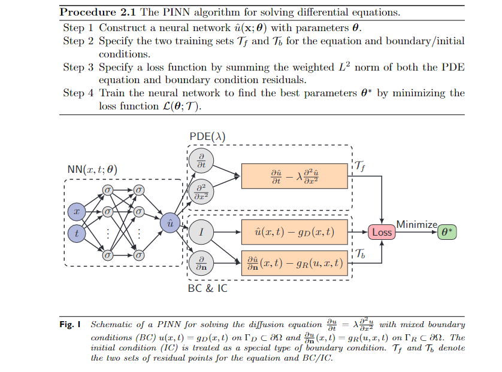


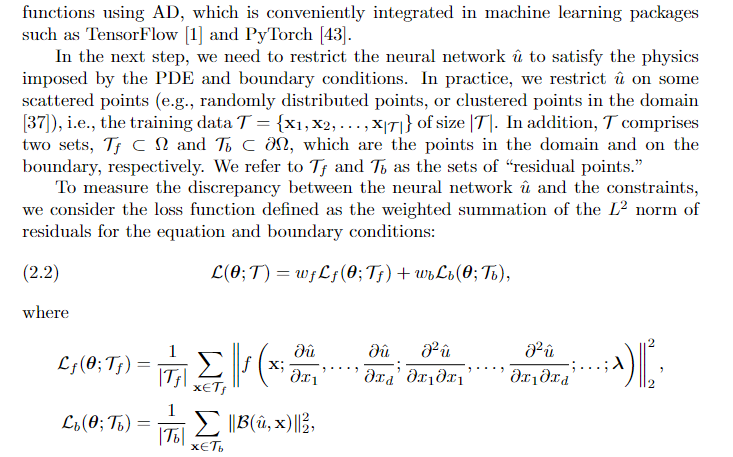

当我们输入一个x，t后，得到u，而loss函数中的u各种导数信息，可借助自动微分技术(AD)求得。

最后，我们会搜索一组参数$\theta$来最小化loss函数，这个过程就是所谓的“training”。考虑到这个loss是关于$\theta$高度非线性的和非凸的,我们通常使用梯度下降，Adam和L-BFGS方法进行最优化过程。

以经验来说，对于光滑的PDEs使用L-BFGS相较于Adam能够在更少的迭代次数中取得好的解，这主要是因为L-BFGS是一种拟牛顿方法，利用到“二阶导信息”。(这点在我的parabolic耦合pde中确定有体现，我的parabolic算例刚好是解比较光滑的)

而对于刚性的PDEs，L-BFGS容易陷入一个局部bad minimum。

PINNs的迭代次数很大取决于PDEs的复杂性（光滑的PDEs收敛速度就比较快）。使用自适应的激活函数能够加速训练，并且可能remove bad local minima。

与传统数值方法不同，PINNs对解的唯一性没有保证，因为PINNs的解是通过解决非凸优化问题，这通常来说是没有唯一解的。在实践中，我们需要跳转人工的变量，e.g. 网络结构和规模大小，学习率，残差点的数量等待。通常，网络规模大小取决于PDEs解的光滑性。例如，一个小型的网络(只有几个层，每层神经元数量也不多)就足以求解1-D的Poisson方程。而对于1D的Burgers方程，我们就需要更多的层(deeper)和神经元个数(wider)

对于不同的初始值$\theta$,PINNs可能收敛到不同的解，一种策略是随机初始化多次进行训练，选择loss最小的网络作为解。

PINNs的原始版本，也就是上面讨论的PINNs，实际上我们是将边界条件作为“软约束(加入loss)”，这种方法能够应用于任何形状的边界条件以及复数域。从另一个方面来说，对于一些简单的边界条件，实际上我们可以令边界条件变成“强约束”。例如，当边界条件是$u(0)=u(1)=0 \ with \Omega=[0,1]$,可以将解设置为 $\hat{u(x)}=x(x-1)N(x)$，自动满足边界条件，$N(x)$是一个神经网络。

对于残差点$\tau$的选择具有灵活多样性，下面提供三种策略：

1. 在训练开始前就指定残差点，可以是网格点或者随机选取。而且在训练过程中不再改变它们。
2. 每次优化迭代，都重新随机选择一批残差点。
3. 在训练过程中，动态地调整残差点的位置,subsection2.8。

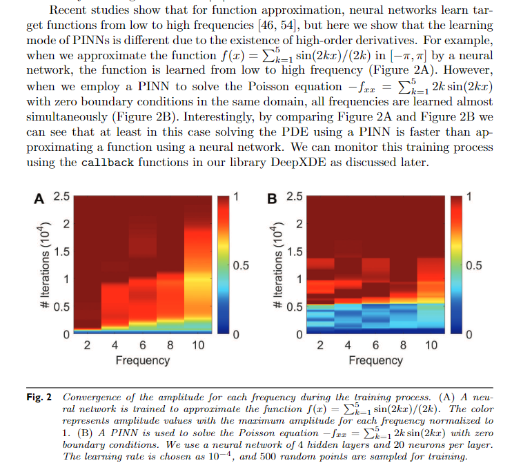

**2.4 PINNs的逼近理论与误差分析**
下面是一些对PINNs理论性分析。

对于PINNs，我们关心的最根本的问题是：是否存在神经网络能同时满足边界条件和PDE方程，i.e. 是否存在神经网络能同时且一致地逼近一个函数及其偏导数。

<center>
    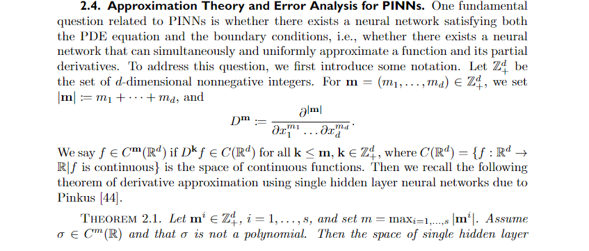,
    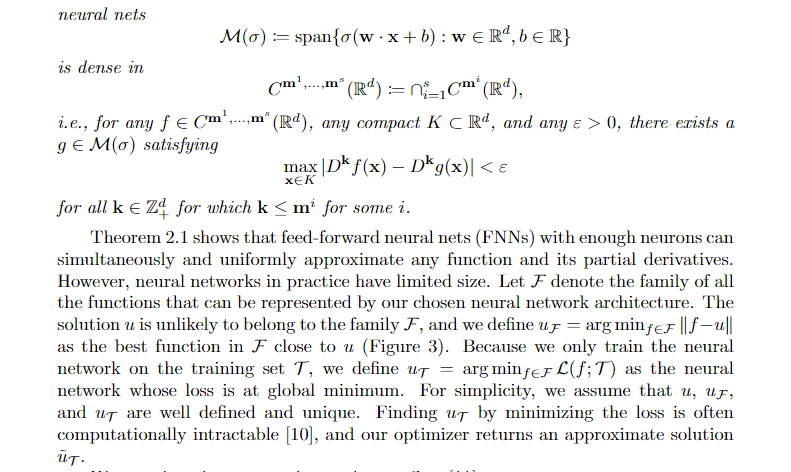
    <br/>
</center>

定理2.1由Pinkus提出，描述了单隐藏层的神经网络的函数表示能力。一言以蔽之，足够多神经元的神经网络，能够同时且一致地逼近一个函数及其偏导数。然而，在实际应用中，神经网络的大小总是有限的。假设$\mathcal{F}$
表示某个神经网络能表示的全体函数，通常来说u不太可能属于$\mathcal{F}$,
定义 $u_{ \mathcal{F}} = arg min_{f \in \mathcal{F}}||f-u||$,$u_{ \mathcal{F}}$是最接近u的函数，就像下图展示的那样。

而我们是在训练集上优化神经网络，定义$u_{\tau} = arg min_{f \in \mathcal{F}} \mathcal{L}(f;\tau)$作为神经网络在训练集上的最优解。为了简单，我们假设$u,u_{\mathcal{F}},u_{\tau}$都具有唯一性和良定的。而我们训练过程中的计算是复杂的，通常只能返回一个$u_{\tau}$的近似解
$u_{\hat{\tau}}$。

如下图所指，我们可以解构整体总体误差$\epsilon$为三个部分。

<center>
    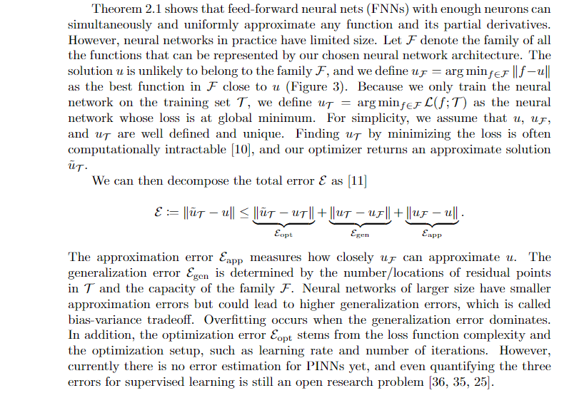,
    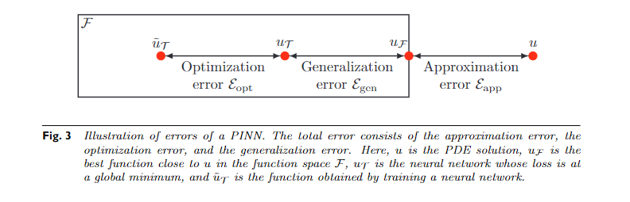
    <br/>
</center>

近似误差$\mathcal{E}_{app}$衡量的是$u_{\mathcal{F}}$近似$u$的程度。泛化误差$\mathcal{E}_{gen}$由训练集中残差点的数量/位置和$\mathcal{f}$族的容量决定。神经网络规模越大，其近似误差越小，但泛化误差越大，这被称为偏差-方差权衡。当泛化误差占主导地位时，会发生过拟合。此外，优化误差$\mathcal{E}_{opt}$来源于损失函数的复杂性和优化设置，如学习率和迭代次数。然而，目前还没有关于PINNs的误差估计，甚至对监督学习的三种误差进行量化仍然是一个开放的研究问题[36,35,25]。

---

# 08-04

## [DeepXDE论文阅读(3)]

[DeepXDE- A Deep Learnin Library for Solving Differential Equations](../论文资料/DeepXDE-%20A%20Deep%20Learning%20Library%20for%20Solving%20Differential%20Equations.pdf)

### **2.5 PINNs与FEM的比较**

<center>
    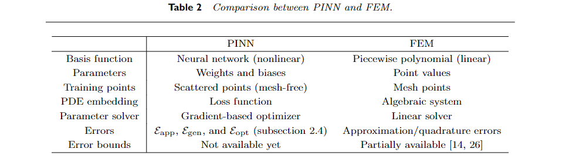
</center>

- 在FEM中，我们用一个分段多项式来近似解u，而在PINNs中，我们构造一个神经网络作为替代模型，参数由权重和偏差。
- FEM通常需要网格生成，而PINNs是完全无网格的，我们可以使用网格或随机点。
- FEM利用刚度矩阵和质量矩阵将偏微分方程转化为代数系统，而PINN则将偏微分方程和边界条件嵌入到损失函数中。
- 在最后一步，有限元中的代数系统是用线性解算器精确求解的，而PINNs中的网络是用基于梯度的优化器学习的。

在根本上不同的是，PINNs提供了函数及其导数的非线性逼近，而FEM表示线性逼近。

### **2.6 PINNs求解积分微分方程**

在求解积分微分方程(IDEs)时，我们仍然使用自动微分技术来解析地导出整数阶导数，而我们使用经典方法来数值逼近积分算子，如高斯求积。因此，我们引入了第四个误差分量，即离散化误差$\mathcal{E}_{dis}$，这是由高斯求积近似得到的。

For example, when solving

$$
\frac{d y}{d x}+y(x)=\int_{0}^{x} e^{t-x} y(t) d t
$$

we first use Gaussian quadrature of degree $n$ to approximate the integral

$$
\int_{0}^{x} e^{t-x} y(t) d t \approx \sum_{i=1}^{n} w_{i} e^{t_{i}(x)-x} y\left(t_{i}(x)\right)
$$

and then we use a PINN to solve the following PDE instead of the original equation:

$$
\frac{d y}{d x}+y(x) \approx \sum_{i=1}^{n} w_{i} e^{t_{i}(x)-x} y\left(t_{i}(x)\right)
$$

PINNs can also be easily extended to solve FDEs and SDEs , but we do not discuss such cases here due to page limit constraints.

<center>
    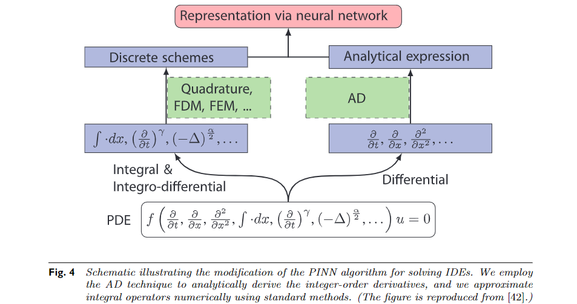
</center>

### **2.7 PINNs求解反问题**

反问题通常是指，在PDEs中有未知的参数$\lambda$,相对地，我们拥有一些额外的信息，比如指定某个子区域$\mathcal{T}_i$的解或者相关信息。

PINNs求解反问题，实际上与求解正问题是一样的，我们只需要在模型中新增$\lambda$变量，根据额外的信息在loss函数中增项，并在训练过程中一起优化$\theta 和\lambda$即可。

$$
\mathcal{L}(\boldsymbol{\theta}, \boldsymbol{\lambda} ; \mathcal{T})=w_{f} \mathcal{L}_{f}\left(\boldsymbol{\theta}, \boldsymbol{\lambda} ; \mathcal{T}_{f}\right)+w_{b} \mathcal{L}_{b}\left(\boldsymbol{\theta}, \boldsymbol{\lambda} ; \mathcal{T}_{b}\right)+w_{i} \mathcal{L}_{i}\left(\boldsymbol{\theta}, \boldsymbol{\lambda} ; \mathcal{T}_{i}\right)
$$

where

$$
\mathcal{L}_{i}\left(\theta, \lambda ; \mathcal{T}_{i}\right)=\frac{1}{\left|\mathcal{T}_{i}\right|} \sum_{\mathbf{x} \in \mathcal{T}_{i}}\|\mathcal{I}(\hat{u}, \mathrm{x})\|_{2}^{2}
$$

We then optimize $\boldsymbol{\theta}$ and $\boldsymbol{\lambda}$ together, and our solution is $\boldsymbol{\theta}^{*}, \boldsymbol{\lambda}^{*}=\arg \min _{\boldsymbol{\theta}, \boldsymbol{\lambda}} \mathcal{L}(\boldsymbol{\theta}, \boldsymbol{\lambda} ; \mathcal{T})$.

### **2.8 基于残差的自适应优化(RAR)**

正如我们在2.3小节中所讨论的，残差点$\mathcal{T}$通常在定义域内随机分布。这在大多数情况下都可以很好地工作，但是对于某些显示具有陡峭梯度的解决方案的偏微分方程来说，这可能不是有效的。以Burgers方程为例;直观地说，我们应该在锋面附近放置更多的点，以便更好地捕捉到不连续性。然而，一般来说，对于解未知的问题，设计一个好的剩余点分布是具有挑战性的。为了克服这一挑战，我们提出了一种基于残差的自适应细化(RAR)方法，以改善训练过程中残差点的分布，在概念上类似于有限元细化方法。

RAR的思想是：
在PDE残差更大的位置上添加更多的残差点，我们反复加点，直到整个区域内的残差的平均值小于一个阈值。

算法流程图如下：

<center>
    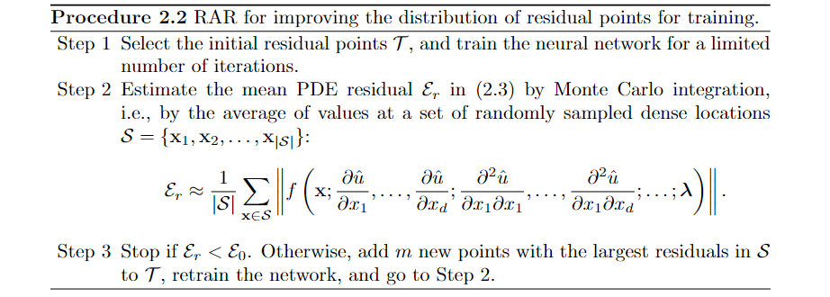
</center>

---

# 08-05

## 各种优化算法

梯度下降算法是一种有效的训练神经网络的方式，在最优化领域梯度下降也是最基本的方法，所谓的训练神经网络就是最优化loss函数。
现在的各种优化算法如Adam、RMSprop等等，都是基于梯度下降的算法。
然而，标准的梯度下降法要求的计算量是很大的，需要对它进行优化，用更少的计算实现差不多的效果。优化梯度下降法有两个思路：优化神经网络结构和优化梯度下降法本身。

## 1.减少计算量

### 1.1 随机梯度下降法

以交叉熵计算损失函数为例,$loss=- \sum_{i=1}^n(y_i*\log_2 \hat{y_i} + (1-y_i)*\log_2(1-\hat{y_i}))$，其中n代表训练样本数量，训练集的数量很大，每次训练如果把所有样本都计算一遍的计算量太大了。

优化思路：

1. 减少每次训练计算量
2. 优化下降的路径，更少的步数更快地达到极值点

随机梯度下降法：
从期望的角度理解损失函数，$loss=\frac{- \sum_{i=1}^n(y_i*\log_2 \hat{y_i} + (1-y_i)*\log_2(1-\hat{y_i}))}{N}$。随机调一个数据，用这个数据计算梯度， 修改参数值，下次训练时，再随机挑一个数据....

随机梯度下降法的收敛性： 凸问题: $f(x^{(k)})-f^*= O(\frac{1}{\sqrt k}),k代表迭代次数，f^*代表极值点$

### 1.2 Mini-batch方法

mini-batch是现在的随机梯度下降法的别称，每次不止调一个数据，而是挑一个batch的数据训练。

## 2. 优化下降路径

严格来说，用一阶taylor展开，梯度指向的是上升最快的方向，负梯度才是下降最快的方向。而梯度是某一个点的下降最快的方向，如果想要把整个下降最优的路径也描绘出来，每次迭代的步长要无线小才行。故，每次迭代有一个确定的步长，而有了这个步长那么下降路径一定不会跟最优的下降路线完全重合。

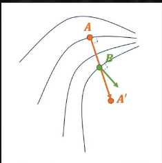

如上图所示，如果每一个下降的步长太长，它可能偏离最优的路径。学习步长由学习率决定。A->A'经过B点，而B点的最速下降方向已经不是AA'了。

如何保证在一定的学习步长，同时又较好地贴近最优路径呢？

### 2.1 Newton法

梯度下降法实际上是一阶泰勒展开，如果步长太大，偏差会较大。而Newton法使用二阶泰勒展开逼近，二次函数有顶点(最小值点)，当学习步长取当前x到该顶点的$\Delta x$时训练效果最好，一旦过了该顶点，近似效果可能还不如一阶导。在一维的情况下，这是很明显的，如图所示。牛顿法的学习步长是确定的。

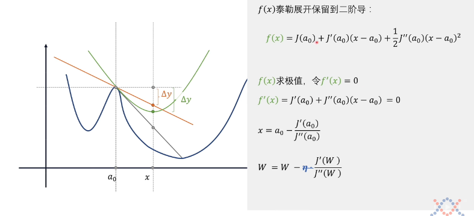

对于多个自变量的情况，标准的Newton法每次要算二阶导的黑塞矩阵，计算上难以接受。尽管如此，牛顿法能给了我们优化思路。因为牛顿法本质是把下降路径的所有维度放在一起，统一考虑(黑塞矩阵，所有维度的2阶导信息)，寻找更好的路径。

下降路径的维度拆分开，一个一个维度考虑。

### 2.2 动量法(冲量法)

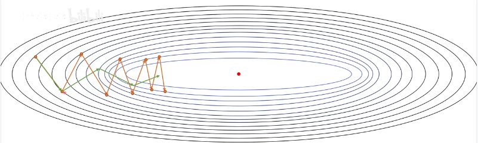

如图所示，橙色的路径振荡地趋于极值点，振荡是我们不太想看到的。如果把下降方向拆分成 横轴和纵轴的分量，发现振荡的原因就纵轴的分量不断正负变化，横轴分量是一直指向极值点的。而绿色的路径，纵轴上的振荡减小，横轴上跨度又增加。

如何做得这一点的？利用历史的梯度修正。将图中橙色路径上一步的梯度和当前步的梯度相加，那么由于纵轴分量方向相反抵消，横轴分量方向相同，那么相加后的方向就是图中绿色路径的方向。

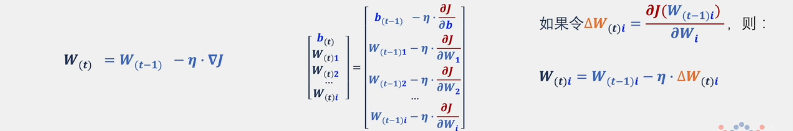


$V_{(t)}$是递归定义，$V_{(t)}$等于上一步的$V_{(t-1)}$+当前步的梯度$\Delta W_{(t)i} \ 它表示第t步，第i个变量W_i的梯度$。

这种定义的一个问题是，如果步数够多，所有历史数据将一视同仁全部考虑。
我们可以对V做一个 `指数加权移动平均法`，使得越近的历史数据权重越大，越远的数据权重越小(趋于0)。

$V_{(t)} = \beta * V_{(t-1)} + (1-\beta)*\Delta W_{(t)i}$


### 2.3 Nesterov方法

不止考虑历史数据，还能超前的考虑"未来"的数据。

<center>
    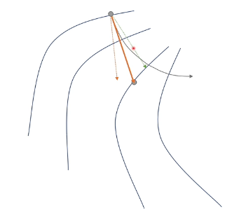
    
</center>

上图中，绿色虚线代表历史冲量，红色虚线代表梯度方法，红色实线代表下降方向。结合这两幅图可以发现，优化路径是有曲折的，向外移动一些，绕了一点远路。

那么，从左图开始，能否通过调整下降方向直接往里偏移？Nesterov方法。

<center>
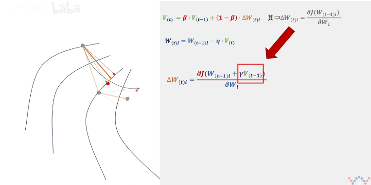
</center>

如上图所示，Nesterov方法对当前步的“梯度”做了调整(大红箭头)。

在冲量法中，计算每步的下降方向，需要先计算当前点的梯度值，再调整$V_{(t-1)}->V_{(t)}$。而Nesterov方法，在第t步中，直接将上一步的冲量$V_{(t-1)}$作为下降方法，计算一个“临时的”$W_{(t)i}=W_{(t-1)i}+\gamma *V_{(t-1)}$(这就是所谓的超前“考虑”未来的数据)。

对这个“临时的”$W_{(t)i}$求偏导，得到第t步的“梯度”$\Delta W_{(t)i}$（已经不是原来意义上的梯度了）。然后在修正$V_{(t-1)}->V_{(t)}$，求得下一步的W。

Nesterov方法中的“梯度”$\Delta W_{(t)i}$就是上图中紫色的虚线，它实际上就是绿色虚线箭头指向的点的梯度向量，平移到上面。

### 2.4 AdaGrad方法

学习率应该随着优化过程减少。如果学习率固定不变，很可能由于无法恰好达到极值点，在极值点附近振荡。最简单的方法，每次迭代学习减少固定数值，但减少的数值是人为给定的。如果设定很大，可能还没达到极值点，学习率就为0，停止训练。如果设定得太小，可能已经到达极值点了，还要振荡很久才会停止，浪费计算。

**如何让学习率自动调整？** 也是基于历史数据。

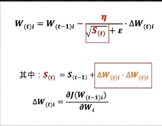

上图中，$S_{(t)}$根据历史数据的变化量而定，当历史数据修正的越多，$S_{(t)}$就更大，从而学习率$\frac{\eta}{\sqrt S_{(t)}+\epsilon}$减少的就越多。

梯度的内积开方，学习到的梯度是真实梯度除以梯度内积的开方。adagrad本质是解决各方向导数数值量级的不一致而将梯度数值归一化。

AdaGrad中自适应学习率的结果和牛顿法中对hessian矩阵做normal approximation是类似的（除了多了开根号）。设J为梯度阵，容易证明JJ^T是对称半正定的矩阵（加和更是如此），为使数值稳定加上了一个轻微扰动。

AdaGrad方法其实不止可以让学习过程最终停下来，更可以调整不同维度上梯度数量级不一致的问题。

如下图所示，紫色的线代表冲量法，灰色的线代表AdaGrad方法。由于在初始点，纵向的梯度更大，紫色线(冲量法)沿着纵向疯狂移动。而AdaGrad方法做了学习率中不同维度数量级的调整($\eta 是一个向量$)，沿着灰色线移动。


AdaGrad方法可以做优化，不要把所有的历史包袱都考虑进来，只考虑比较当前比较近的部分历史。做法还是 `指数加权移动平均法`，不再赘述。

优化过后AdaGrad的算法称为 `RMSprop方法`。

### 2.5 Adam和Nadam方法

AdaGrad(RMSprop)方法只考虑修正学习率，实际上可以把AdaGrad方法和动量法结合起来，因为动量法只考虑修正了下降方向。

这个结合的算法就是Adam算法。


而AdaGrad(RMSprop) 与 Nesterov结合就是 Nadam方法。

[随机梯度下降、牛顿法、动量法、Nesterov、AdaGrad、RMSprop、Adam、Nadam](https://www.bilibili.com/video/BV1r64y1s7fU)
