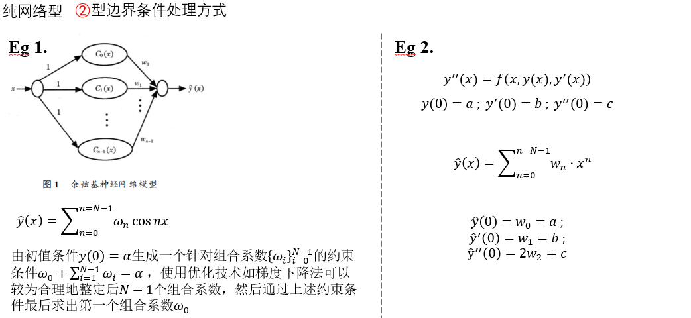
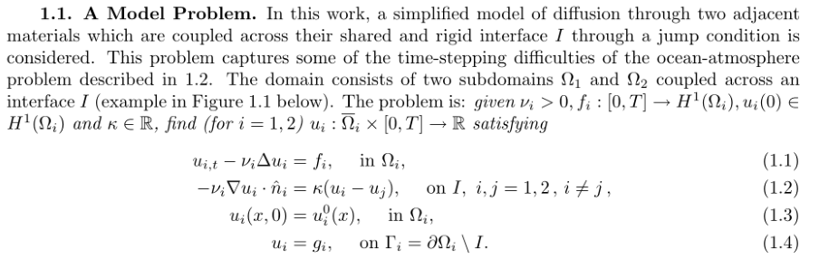
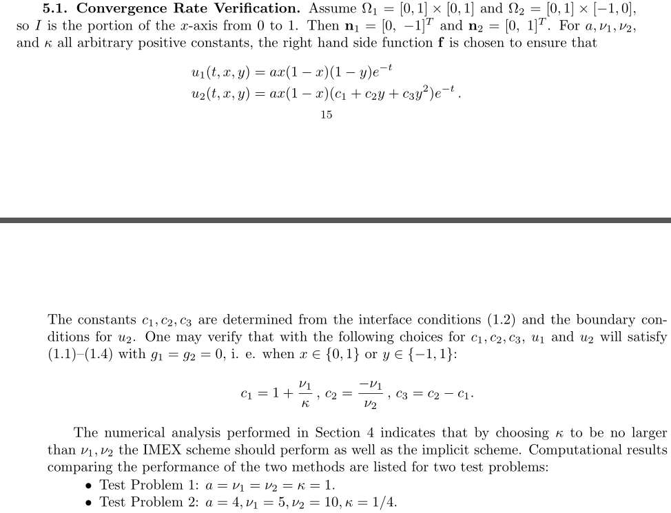
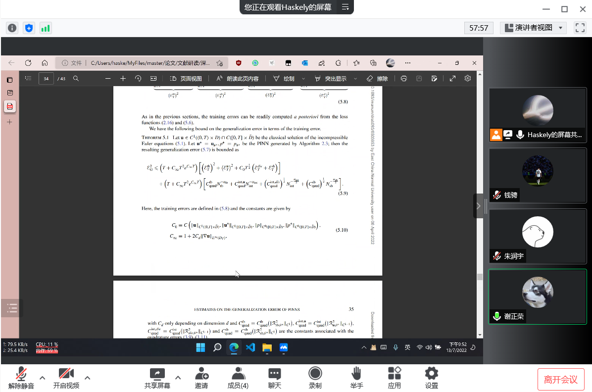

# 耦合PINN、正反问题、3D问题的学习研究


# 06-29 

### 什么是PINN？

Raissi等人在2018年 

 [Physics-informed neural networks: A deep learning 
framework for solving forward and inverse problems involving 
nonlinear partial differential equations](https://github.com/maziarraissi/PINNs)

中提出了PINN，通过在损耗函数中结合物理场（即偏微分方程）和边界条件来解决偏微分方程。损失是偏微分方程的均方误差和在分布在域中的“搭配点”上测量的边界残差。


他们在文章中列出了数个经典pde算例来验证PINN的正确性。在他们的github主页上提供了源码，使用了Tensorflow1.x的框架。

截止到2022-06-29，TensorFlow更新到2.9，TensorFlow1.x代码风格跟TensorFlow2.x相差甚远，而且Raissi等人提供的代码也有许多值得优化的地方。

我在github上找到一个了PINN在TensorFlow2.x上的代码框架 [omniscientoctopus/Physics-Informed-Neural-Networks: Investigating PINNs (github.com)](https://github.com/omniscientoctopus/Physics-Informed-Neural-Networks),


### 本文研究什么？

利用暑假研究一下如下问题： 

- PINN模型在耦合问题上的应用（这方面的研究似乎还不多），
- PINN正负问题求解（看了一些文章说PINN的优势其实在于 **高维问题 & 反问题求解**
- 代码实现若干算例（也许可能maybe Only one😁），最好能把模型应用到3维。


### PINN模型搭建

> 工欲善其事必先利其器，先掌握TensorFlow，并使用TensorFlow自定义PINN模型是必要的。

先设想一个代码框架。

PINN的模型比较简单，如果先不考虑loss函数，那么PINN就是一个普通的全连接序列模型，可以用 **tf.keras.Sequential()**构建。

假设Layer = [inputs,n1,n2,...nk,n_outputs]，从左至右代表每层神经元的个数。

```python
def createModel(layer):
    if len(layer) < 2:
        print("层数小于2！, 无法构建神经网络")
        return 
    model = keras.Sequential(name = "PINN")
    model.add(keras.Input(shape=(layer[0],)))
    for i in range(1,len(layer)-1):
        model.add(layers.Dense(layer[i], activation="relu", name="layer{}".format(i)))
    model.add(layers.Dense(layer[-1], name="outputs"))
    
    #  model.compile( loss= , metrics = [], optimizer= )
    #	...
    #
    #
    
    return model
```

**<font color='purple'>后续要为 model 添加 loss（PINN主要部分）、metric（可以不要）、optimizer（优化器，必要）</font>**

> 以上内容于 2022 -  06 - 29  markdown。

---

# 06-30

### <font color='blue'>1.PINN模型搭建（续）</font>

TensorFlow为我们提供了多种多样的高阶API帮助我们快速搭建模型。**但是，快速方便的代价就是灵活性降低。**特别是PINN跟一般的机器学习模型训练步骤不同，主要来源于loss function需要对预测值进行求导运算。

今天的代码编写遭遇了一些困难，我昨天的构思实际上不可行：

1. 使用 **tf.keras.Sequential()**或者**tf.keras.Model()函数式API** 搭建模型 Model。(这一步没问题）

2. 编写自定义loss函数，然后将 自定义的loss & 优化器 & metrics 传入自带的方法 **Model.compile()**

3. 调用自带的方法 **Model.fit()** ，传入训练数据训练即可。


步骤1 和 （步骤2，步骤3）是相对独立的。而PINN模型结构简单，使用步骤1搭建模型完全没有问题。

问题出在（步骤2，步骤3）。

让我们先来看看其中两个关键的方法 **Model.compile() & Model.fit()** 方法究竟做了什么？

如果明白了Model.fit()的工作步骤，就会知道这种自带的训练方式局限性，以及为什么在训练PINN模型时，我们需要自定义训练过程。


**Model.fit()大致工作流程如下：**

```python
def fit(self,X_train,Y_train,epoches,batch_size,**kwargs):
    #
    #		主要的训练部分代码
    #
    for epoch in epoches: ## 使用 X_train,Y_train 进行 epoch 次训练
        for x_batch,y_batch in dataset(X_train,Y_train,batch_size): ## dataset(X_train,Y_train,batch_size) 数据分组
            train_step((x_batch,y_batch))  ## train_step(self,data) 是 类中的方法，可以重载，从而改变fit()

def train_step(self,data):
    
    # Unpack the data. Its structure depends on your model and on what you pass to `fit()`.
    x, y = data

    with tf.GradientTape(persistent=True) as tape:
        y_pred = self(x, training=True)  # Forward pass
        loss = self.compiled_loss(y, y_pred, regularization_losses=self.losses)
        #这里用到的 self.compiled_loss() 就是 Model.compile(loss) 传入的loss
        #即 Model.compile() 作用是让 self.compiled_loss = loss
                       
	# Compute gradients
    trainable_vars = self.trainable_variables
    gradients = tape.gradient(loss, trainable_vars)

    del tape

    # Update weights
    self.optimizer.apply_gradients(zip(gradients, trainable_vars))
    
    #指标计算（可选）
    #....
```


可以看到 **Model.fit()**只是为我们定义一个一般普通的训练步骤函数，并没有什么特殊。

**Model.fit()** 会在 train_step() 中调用 Model.compile() 传入的loss、优化器、指标。

```python
loss = self.compiled_loss(y, y_pred, regularization_losses=self.losses)
```

上述代码中compiled_loss()限定了参数 y , y_pred。y是标签值，y_pred是通过模型预测的值。


这也是为什么官方文档、网上的帖子说：

**如果想自定义loss，那么你自定义的loss函数一定要有两个输入参数（y，y_pred)。**

**因为在 fit() ——》train_step()中，调用了self.compiled_loss()，并规定了它的参入参数为（y,y_pred)**。


当然，我们可以重载 train_step() 使自定义loss函数自由度更高，并仍能使用fit()。

甚至重载fit()，但既然都重载fit()了，它等价于从0编写训练过程。——不过，这正是PINN训练需要的。

**因为我们有不同格式的训练数据（带标签和不带标签）、复杂的loss函数（不仅仅需要y，y_pred，还需要y_pred对x，t的导数），所以在这种情况下，仍然使用fit（）代码框架，需要大刀阔斧地修改。还不如自己写训练过程，不去使用所谓的高阶API~~**


### <font color='blue'>2.子类化Sequential() / Model() , 定义 MyPinn，自定义训练过程</font>

之前讨论过**步骤1：使用Sequential搭建模型** 是没有问题的，我们需要做的仅仅是重新定义**训练过程**。

那么，子类化**class MyPinn(tf.keras.Sequential())**，MyPinn保留Sequential()好用的功能，再附加上我们自定义的**训练过程**

```python
class MyPinn(keras.Sequential): ## 以Burgers_Equation为例
    def __init__(self,name = None):
        
        super(MyPinn, self).__init__(name=name)
        self.nu = tf.constant(0.01/np.pi)
    
    @tf.function
    def test_gradient(self,X_f_train):
        x = X_f_train[:,0]
        t = X_f_train[:,1]
        with tf.GradientTape() as tape:
            tape.watch([x,t])
            X = tf.stack([x,t],axis=-1)
            u = self(X)
        u_x = tape.gradient(u,x)
        tf.print(u_x)
    
    @tf.function
    def loss_U(self,X_u_train,u_train):
        u_pred = self(X_u_train)
        loss_u = tf.reduce_mean(tf.square(u_train - u_pred))
        return loss_u
    
    
    @tf.function
    def loss_PDE(self,X_f_train):
        x = X_f_train[:,0]
        t = X_f_train[:,1]
        with tf.GradientTape(persistent=True) as tape:
            tape.watch([x,t])
            X = tf.stack([x,t],axis=-1)
            u = self(X)  
            u_x = tape.gradient(u,x)         
            
        u_t = tape.gradient(u, t)     
        u_xx = tape.gradient(u_x, x)
        
        del tape
        
        f = u_t + (self(X_f_train))*(u_x) - (self.nu)*u_xx

        loss_f = tf.reduce_mean(tf.square(f))

        return loss_f
    
    
    def loss_Total(self,X_u_train,u_train,X_f_train):
        loss_u = self.loss_U(X_u_train,u_train)
        loss_f = self.loss_PDE(X_f_train)
        
        loss_total = loss_u + loss_f
        
        return loss_total
    
    @tf.function
    def train_step(self,X_u_train,u_train,X_f_train):
        with tf.GradientTape(persistent=True) as tape:
            loss_total = self.loss_Total(X_u_train,u_train,X_f_train)
                   
        trainable_vars = self.trainable_variables
        gradients = tape.gradient(loss_total, trainable_vars)
        
        del tape
        
        self.optimizer.apply_gradients(zip(gradients, trainable_vars))
        return loss_total
    
    def train_model(self, X_u_train,u_train,X_f_train, epochs=100):
        for epoch in tf.range(1,epochs+1):
            loss_total = self.train_step(X_u_train,u_train,X_f_train)
            if epoch % 10 == 0:                
                print(
                    "Training loss (for per 10 epoches) at epoch %d: %.4f"
                    % (epoch, float(loss_total))
                )
```


<font color='purple'> **在当前文件夹 myPINN.py 进行了train_model测试，成功运行**</font>

> 以上内容截止至 6-30 markdown

---

# 07-01

### <font color='blue'>优化器</font>

tf.keras.optimizers为我们提供了许多现成的优化器，比如SGD（最速下降）、Adam、RMSprop等等。


假设，现有模型对象 MyPinn。

可以通过 tf.keras.optimizers.Optimizer() 创建优化器对象。例如， MyPinn.optimizer = tf.keras.optimizers.SGD()

tf.keras.optimizers.Optimizer()主要提供了两种Methods，为我们的参数进行优化。

1. **apply_gradients(**
       **grads_and_vars, name=None, experimental_aggregate_gradients=True**
   **)**

​	之前定义的MyPinn.train_step()中就使用了这种Method。

​	我们先计算出grads，再使用apply_gradient()，进行参数优化。

2. **minimize(**
       **loss, var_list, grad_loss=None, name=None, tape=None**
   **)**

   minimize()方法先使用tf.GradientTape()计算出loss，再调用apply_gradients()。相当于把compute gradients和apply gradients 封装在一起。

可以发现，apply_gradients()就是minimize()中的第二步。

**为了精准地控制优化过程，并在优化过程中加上一些别的操作，我们使用 第1种方法 对参数进行优化。**


### <font color='blue'>  Adam & L-BFGS </font>

Adam优化器在deep neural network中具有广泛的应用。之前也说过，tf.keras.optimizers里内置了Adam优化器，我们直接调用就好。

在PINN原作者的代码中(tensorflow1.x)，他们使用了两种优化器 ： Adam & L-BFGS。

在 training model 过程中，他们先使用 Adam 进行优化，后使用 L- BFGS 进行优化。


L-BFGS 是 秩2的拟牛顿方法(这学期 “最优化方法” 课上刚好学过)，它是基本牛顿方法的一种变形。牛顿方法在极值点附近时，收敛速度快，而拟牛顿方法在保持这个优秀性质的基础上，改进了牛顿方法过程的一些缺点，比如计算二阶导、矩阵求逆和G不正定等问题。


然而在TensorFlow1.x中 并没有内置的 L-BFGS，作者实际是使用tensoflow1.x 提供的一个接口，使用 Scipy 库中的 L-BFGS。

Scipy中调用L-BFGS的格式是：

```python
scipy.optimize.minimize(fun, 
				x0, args=(),
                method='L-BFGS-B', 
                jac=None, hess=None, hessp=None, bounds=None, constraints=(), tol=None, callback=None, options=None)
```

 其中fun是一个目标函数，返回目标函数值。

> ```
> fun(x, *args) -> float
> ```

where `x` **is a 1-D array with shape (n,)** and `args` is a tuple of the fixed parameters needed to completely specify the function.

> 当 jac = True 时， fun()  retrun fval , gradients


这时，再看一下作者调用L-BFGS的代码，就知道是什么意思了。。

```python
self.optimizer =tf.contrib.opt.ScipyOptimizerInterface (self.loss, 
                                                        method = 'L-BFGS-B', 
                                                        options = {'maxiter': 3000,
                                                                   'maxfun': 3000,
                                                                   'maxcor': 50,
                                                                   'maxls': 50,
                                                                   'ftol' : 1.0 * np.finfo(float).eps})
```

这时如果我们写 self.optimizer.minimize() 实际上就会调用 scipy.optimize.minimize( args ) ，args=上述代码中传入的参数，self.loss 相当于 fun。


遗憾的是，在TensorFlow2.x中，该接口已经删除。

当然我们仍能想办法使用Scipy中的L-BFGS，

无非就是按照scipy.optimize.miminze()的调用格式，在MyPinn内部定义一个loss_fun(x) ，x is 1-D array with shape = (n,)，

作为scipy.optimize.miminze(fun,...)中的fun，但这意味着需要把MyPinn的weights和bias "扁平化" 放在一个1维数组中，在优化完毕后，还要把结果再变成原来的形状，放回MyPinn里。


又但是，虽然接口没了，但TensorFlow2.0中 tfp 库中有实现 L-BFGS 算法。😁


**下面链接中，高赞回答讨论了在TensorFlow2.x中使用 Scipy的L-BFGS 和 自带的L-BFGS 计算差别。**

[python - Use Scipy Optimizer with Tensorflow 2.0 for Neural Network training - Stack Overflow](https://stackoverflow.com/questions/59029854/use-scipy-optimizer-with-tensorflow-2-0-for-neural-network-training)


**可以发现使用TensorFlow2.0 tfp中的L-BFGS计算速度更快**

**不过tfp中的L-BFGS计算结果略逊于Scipy中的L-BFGS，可能是TensorFlow默认float32，而Scipy是float64，以及Scipy中L-BFGS算法的实现比tfp的更好。**


[Optimize TensorFlow & Keras models with L-BFGS from TensorFlow Probability | import pyChao](https://pychao.com/2019/11/02/optimize-tensorflow-keras-models-with-l-bfgs-from-tensorflow-probability/)

注意如果想使用tfp的L-BFGS也是要求输入变量是1-D的。而我们的PiNN模型中的weights和bias都是以多维的形式保存，所以要先将它们进行“扁平化”，再传入L-BFGS函数中。

上面的链接讨论了如何定义将model中的变量“扁平化”，变回来 以及 如何定义“function_factory"返回一个LBFGS需要的function。


我们看下tfp中L-BFGS的调用格式：

```python
tfp.optimizer.lbfgs_minimize(
    value_and_gradients_function,
    initial_position,
    num_correction_pairs=10,
    tolerance=1e-08,
    x_tolerance=0,
    f_relative_tolerance=0,
    initial_inverse_hessian_estimate=None,
    max_iterations=50,
    parallel_iterations=1,
    stopping_condition=None,
    name=None
)
# value_and_gradients_function 是一个函数, 
# Input: paramters with shape = 1-D ; Output: loss and gradients with paramters, gradients are also 1-D.

# initial_position: initial paramters 
```

<font color='purple' >**对MyPinn模型(keras.Sequential模型)使用tfp L-BFGS()进行参数优化流程如下：** </font>

1. 提取MyPinn中的weights 和 bias (即需要优化的parameters)，此时它们就是initial_position(未扁平化)。

2. 创建两个列表 idx=[],part=[]

3. 把MyPinn每层参数的shape等若干信息，用循环append到idx和part。

   idx帮助我们调用 tf.dynamic_stitch()将weights和bias"扁平化"成params_1d。

   part帮助我们params_1d变回weights和bias,并更新MyPinn中的参数。

4. 定义一个func函数,func(params_1d)

​		Input:  params_1d

​		Output: loss , gradients

​		Inside：先把 params_1d 转变回 MyPinn 中 weights,bias 的shape，并更新它们。

​					  使用MyPinn中已定义的loss_Total()方法计算loss 和 gradients。

​				      注意：需要将 gradients 也扁平化 再return。( gradients.shape = [weights,bias].shape,故也可以用idx扁平化 )

5.  将第一步提取出来的weights 和 bias 扁平化处理，作为initial_position
6. 调用tfp.optimizer.lbfgs_minimize(func,initial_position)即可！

> 以上内容截止至 7-1 markdown

---


# 07-04

​	今天主要添加了 Data Preparation 和 Plot 的代码。并且，按日期命名，将代码分开在不同的NoteBook。

​    使用下面链接中的训练数据。

​	[Optimize TensorFlow & Keras models with L-BFGS from TensorFlow Probability | import pyChao](https://pychao.com/2019/11/02/optimize-tensorflow-keras-models-with-l-bfgs-from-tensorflow-probability/)

​	不过，我在使用MyPinn训练Burgers Equation，训练结果不太理想。一开始，我怀疑是，float32格式 **And** tfp中lbfgs与Scipy中lbfgs的差别。debug了很久，发现不是这些原因。

​	因为上面的链接中，作者也有用tfp中的lbfgs训练模型，我运行了一遍，仍然可以达到很好的效果，看来还需要debug(恼。


​	题外话，使用Google colab可以白嫖算力，将.ipynb文件上传，可以在云端计算，还免费，而且我的电脑内存有时候不太够用，所以colab就很nice。


> 以上内容截止至 7-4 markdown

---


# 07-05 Debug

今天花了不少时间，总算让我发现了这个所谓的“bug”。**“找bug时间，比写代码时间要长”这次真的印证了这句话吧。**

过程中，我甚至一度想要放弃自己的MyPinn模型，使用别人的构建模型代码（比如上面的链接） 。

**在解释bug之前**，我需要说明一下，为什么我自己要用构建一套TensorFlow2.x的Pinn class，而不是用别人的。

[Optimize TensorFlow & Keras models with L-BFGS from TensorFlow Probability | import pyChao](https://pychao.com/2019/11/02/optimize-tensorflow-keras-models-with-l-bfgs-from-tensorflow-probability/)

**为方便说明，我将上述链接中的pinn代码称为 code**。

1. TensorFlow2.x默认是eager动态图模式，这种模式计算速度比较慢，但方便调试。使用@tf.function函数装饰器，能将 eager转为**AutoGraph动态图模式**计算，效率堪比TensorFlow1.x的静态图（tf1.x只支持静态图），同时也方便调试。**但是呢，@tf.function 有一定的编程规范。**

   而 **code**，没有使用TensorFlow2.0的@tf.function功能。

   这是原因一。

2. **高阶API**。tf.keras已经为我们提供了各种层、优化器、损失函数等 以及 **2种主要构建模型的方式**：Sequential()，函数式API。灵活使用函数式API，理论上可以构建任何模型，不单单是神经网络。而Pinn使用Sequential()即可。比如，我的代码就是让MyPinn继承keras.Sequential

   而在**code**中，Pinn继承的是keras.Module，Module实际上是Sequential等高阶API的基类，它提供的功能是记录在类中出现的Variables，而没有Sequential中更多好用方便的功能，比如直接使用add方法，搭配keras.layers.Dense，为MyPinn添加层(本质上也是添加Variables)。

   若使用**code**中的方法，让Pinn单单继承Module，则需要自己做变量初始化，并且没有别的好用的功能。它只能记录class中出现的变量而已。

   这是原因二。

3. **优化器**。在code中为了使用LBFGS，在类中定义了 “变量一维化、一维变量转为原来形状”等 专门为使用LBFGS的函数。我不喜欢这样子。

   **为了清晰性，我更倾向于将模型定义和优化方法分离开，而不是全在写在class中。**

    “变量一维化、一维变量转为原来形状”这样的函数，只是为使用LBFGS服务的，他应该定义在外面。如果使用内置的Adam、SDG等优化器，完全不需要定义这些函数，直接在train_step()中，optimizer.apply_gradient（）即可。

   这是原因三。


所以bug出现在哪呢？@tf.function 编程不规范？ 变量名写错？

**在loss_PDE的定义中。**


下面我分别给出我自己的定义以及code的定义

```python
def loss_PDE(self,X_f_train): #我的定义
    
      x = X_f_train[:,0]  # x.shape =(nums,)
      t = X_f_train[:,1]  # t.shape =(nums,)
      with tf.GradientTape(persistent=True) as tape:
          tape.watch([x,t])
          X = tf.stack([x,t],axis=-1) # X.shape = (nums,2)
          u = self(X)  # predict u
          u_x = tape.gradient(u,x)
```

```python
def loss_PDE(self,X_f_train): #code的定义
      
      x = X_f_train[:,0:1] # x.shape = (nums,2)
      t = X_f_train[:,1:2] # t.shape = (nums,2)
      with tf.GradientTape(persistent=True) as tape:
          tape.watch([x,t])
          X = tf.stack([x[:,0],t[:,0]],axis=1) #X.shape = (nums,2)
          u = self(X)  # predict u
          u_x = tape.gradient(u,x)
```

两种代码的第3行和第4行，干的都是同一件事，把X_f_train的 x 和 t 分离出来（后面要对x，t求导）。

```python
with tf.GradientTape(persistent=True) as tape:
	....
```

上述将计算过程记录在“tape”中，后面可以求tape中出现变量（包括中间变量）的导数。

tape.watch([x,t])将x，t也记录到tape中，因为默认只记录variables，而此处x和f是constant。

我们将x,t通过tf.stack()拼接到一起组成模型的input：X，调用self(X) predict u。tf.stack也会被看做一种算子，被记录到tape中。

你或许发现X和loss_PDE函数传入的X_f_train**数值上一样**，为什么不直接self(X_f_trian)呢？**因为它仅仅是数值上一样。。。**

可以试一下改用u=self(X_f_train)，那么u_x返回的None。


令人我感到奇怪的是，两种代码的第7步，最后返回的X是一样的，为什么只有第二种（code的实现）OK？而我的就不行。

其实我在写代码的时候，参考了code的loss_PDE，觉得他的操作有点**多余**，就用了一种更清楚的写法，正如第一种写法那样，然而训练的结果就是，第一种不行！？


**下面我再验证一下两种写法的(第7行)X是否一致?** 


结果显示 g 和 gg ，确实是一样的（全是True，没有截完全)，令人疑惑。

**不管了。后面我使用了code的写法.模型的loss函数能不断下降了，效果见7_4-7_5MyPINN_Burgers.ipynb**

> 以上内容截止至 7-5 markdown

---

# 07-06

今天阅读学习了一些NN在PDE求解问题中的多种方法。

### 神经网络常见结构


**目前PINN大多为全连接前向网络(tensorflow中的Dense层)，尝试使用如卷积层、循环网络、反馈网络？**


### 神经网络对边界条件的处理方式

ANN: artificial neural network

1. 纯网络型

   1. 1  Loss = $\lambda_1 * MSE_{pde} + \lambda_2 * MSE_{BC}$  ， 原始的PINN模型就使用的是这种方式，利用边界条件和预测值计算$MSE_{BC}$,纳入loss中。

   1. 2  将边界条件带入神经网络表达式——取代部分weights，通过微分方程残差$MSE_{pde}$优化剩余权值。如下图所示：



​			**但我认为，对于某一个复杂pde，代码实现这种思想并不容易。**

2. 边界吸收型

​	边界吸收型的思想是：把神经网络看做函数 ANN(X)；构造边界函数BC(X)：当X∈边界时，BC为边界值，否则为0；构造 L(X)，当X∈边界时，L(X)=0.

令试解  $y_t = BC(X) + L(X) * ANN(X) $, 此函数严格满足边界条件。再通过域内点计算$MSE_{pde}$，更新ANN。

​	**BC(X),L(X)的构造方法：**

​	


**在PDE中如何解释ANN(X)的作用？** 通用BC(X),L(X)的构造方法？


进一步，使用独立网络$ANN_{BC}$代替BC(X)。


有了这种独立网络的思想，也有人提出多网络的模型。即用独立的网络分别预测PDE中的各种偏导，最后把loss加在一起。

---

# 07-07

今天主要阅读学习了张学长的论文，关于使用PINN求解Navier-Stokes/Darcy耦合模型的正反问题。

## 正问题与反问题

正问题：

已知pde方程组，初边值条件，求解析解或者数值解。

反问题：

已知pde方程组，或不知道初边值条件，或不知道模型中某些参数的值，取而代之，知道区域内部的一些数值真解，反推整个区域的解或者模型参数。

---

## 求解思路

**对于正问题：**

构建两个独立的神经网络$NN_1 和 NN_2$，但是他们的输入层input是相同的，$NN_1$用于求解Naiver-Stokes方程$U_1$，$NN_2$用于求解$U_2$,根据Navier-Stokes/Darcy耦合模型中的pde方程和初边值条件，用$U_1 和 U_2$构造残差，加在一起，组成loss。训练神经网络。

**对于反问题：**

假设，初边值条件未知，但知道一些内部区域的数值解。只需要把loss中的初边值MSE去掉，改成关于内部区域的数值值的MSE。其实在PINN中，初边值和内部区域的数值解 可以看做是同等低位的。

假设，方程组中某些物理参数值未知。只需要把它们设置为Variables，纳入loss，与NN的参数一起训练。


不得不说，Native-stokes/Darcy耦合模型的方程组还是比较复杂的，张学长的论文中，使用2d具有解析解的算例，使用最原始的PINN模型结构求解，效果还算不错。

但当问题变成3d，loss更加复杂时，并且还有一个问题，由于高阶导数的存在，使用这种最原始的PINN模型解Navier-Stokes/Darcy耦合模型，应该很慢。

从NN的模型结构和训练策略上做一些调整，应该算是比较自然的优化策略。

---

# 07-08

##  	小批量训练模式实验

​	阅读一篇论文，关于pde耦合模型的数值求解方法。

​	PARTITIONED TIMESTEPPING FOR A PARABOLIC TWO DOMA.pdf

​    试了下小批量训练。将全部训练数据 **n等分后**，进行小批量训练。在相同的epochs下，小批量训练效果比原来好。效果见"7_8_myPINN_Burgers.ipynb"

---

# 07-11 

## PINN求解parabolic耦合pde模型

​	用PINN求解最简单的parabolic耦合pde模型——PARTITIONED TIMESTEPPING FOR A PARABOLIC TWO DOMA.pdf






模型定义和训练模型的代码写好了，画图的还没写。训练数据的生成代码，写的有些冗长，后面会优化一下。

代码见 **7_11_Parabolic耦合pde模型.ipynb**


**网络结构:** 

两个独立的神经网络$NN_1 , NN_2$，分别用于预测$u_1,u_2$, 构造 $ loss = loss_{u1} + loss_{u2} + loss_{interface}$，每次训练同时训练两个网络，耦合性体现在$loss_{interface}$.


每次训练模型，$NN_1 和 NN_2 $各自传入一批"不同的" 内部点训练集 和 边界点训练集(不包括interface)。 $NN_f和NN_p$在interface处的训练集。

---

# 07-12

##  训练parabolic耦合pde的PINN模型

​	u1拟合的比较好。u2拟合效果很差，特别是在边界处。

​	正在研究，不知是代码有错，还是说因为u2表达式比较复杂，有y的二次项。

​	训练代码见  **7_11_Parabolic耦合pde模型.ipynb**

---

# 07-13 

## **与2位学长会议交流，讨论PINN**

解决了不少疑问，PINN在边界处的拟合效果确实一般。



---

# 07-15——07-17 

## **改进parabolic耦合pde的代码。**

改进方案如下：

1. 与同学讨论发现，之前的采样点为等分，不够“随机”，使用normal或者拉丁高次方采样效果更好
2. 训练次数不足，增加训练次数
3. 将边界点也同时纳入内部点训练，导致在较少训练次数下，边界处效果不好
4. 耦合阶段训练结束后，继续对两个区域分布进行单独的PINN训练，使得精准度进一步提升

效果见 **7_15_改进版Parabolic耦合pde.ipynb**


---

# 07-18 

## 	代码 & 论文阅读

​	TensorFlow2.0 Metric评估函数 ，代码见 tensorflow学习记录/12_Metric.ipynb

​	阅读 [Deep Learning-An Introduction](../论文资料/Deep Learning-An Introduction.pdf )。这篇文章从数学角度，从零开始介绍Deep Learning，是一篇介绍性的文章。	

---

# 07-20

## Self-Adaptive PINN

今天对parabolic耦合pde的PINN模型进一步改进。主要有如下两个方面：

1. 预训练模式
2. 自适应loss函数因子

**预训练模式**：在训练耦合模型前，先各种单区域进行PINN训练。有利于耦合模型边界训练，以及训练效率。

**自适应loss函数因子：**
$$
Loss = \alpha_1 * loss_{u1} + \alpha_2 * loss_{u2} \\
loss_{u1} := loss_{u1}^{bc} + loss_{u1}^{f} + loss_{u1}^{i} \\
loss_{u2} := loss_{u2}^{bc} + loss_{u2}^{f} + loss_{u2}^{i} \\
$$
​	其中$\alpha_i$就是自适应因子。

​	考虑到实际训练过程中，u1和u2的loss大小不一样，**”优先“**训练loss较大的一方，即在$loss_{ui}$前乘上一个较大的因子，使其在整个**$Loss$**中占比更大，从而达到优先训练的目标。

**什么是自适应？**

​	把$\alpha_1,\alpha_2$也看做变量。在训练模型参数的过程中，我们使用的梯度下降算法，是基于“负梯度”。

​	如果使用**“正梯度”**去改变$\alpha_1,\alpha_2$，能够使得$loss_{ui}$对应的$\alpha_{i}$更大。

​	实际上，使用这种策略，不断地训练会使得$\alpha$一直增大，同时为了控制$\alpha$的值，可以套一层sigmoid函数，使得$\alpha$控制在0-1之间。$初始化\alpha=0，\alpha=tf.math.sigmoid(\alpha)$, 

---

# 07-21

## 优化训练步骤

1. 预训练——单区域训练
2. 耦合训练——Adam算法
3. 耦合训练——LBFGS算法

**代码见0721_自适应&LBFGS_Parabolic耦合模型.ipynb**<br />比较Adam算法和LBFGS算法的训练表现。<br />（有必要深入了解Adam的性质，在训练后期表现远不如LBFGS）

# 07-22

## 区域反问题

​	流体力学领域还存在各种各样的反问题，比如物理模型的初边值 条件是未知的，取而代之的是已知内部部分区域或部分物理量的数值真解，以此 反推整个区域的流体运动情况；或者，物理模型的方程本身具有一些未知参数， 需要通过真实的数值结果进行反推。这类问题在工程应用中具有很大意义，然而 各种传统方法对此类问题的求解具有一定的难度，在本文神经网络求解的框架 下，却很容易对该类反问题尝试进行求解。

​	使用之前的Parabolic 耦合PDE模型进行区域反问题的实验。

对**区域1{(x,y)|0<=x<=1,0<=y<=1}**的划分为：

​								 regions_x = [ [0.10,0.30],[0.40,0.60],[0.70,0.90] ]

​								 regions_y = [ [0.10,0.30],[0.40,0.60],[0.70,0.90] ]

对**区域2{(x,y)|0<=x<=1,-1<=y<=0}**的划分为：

​									regions_x = [ [0.10,0.30],[0.40,0.60],[0.70,0.90] ]

​									regions_y = [ [-0.10,-0.30],[-0.40,-0.60],[-0.70,-0.90] ]

3 * 3 = 9，每个区域被分为9个子区域

**将原来边界处的X_u_train,u_train替换会这些子区域内的点和对应的解。**

> 区域的划分有讲究，若区域过于小或者覆盖率低等，可能导致整个区域内拟合效果和真解差距大，解可能不唯一。

代码见 **0722_区域反问题 Parabolic耦合模型.ipynb**

---

# 07-23 

## 参数反问题

​	参数反问题是指已知部分、乃至全部真解，反推模型的参数，以传统方法来说，这是很困难的，但在PINN框架下，只需要将模型参数设为变量，带入真解训练模型（同时训练参数），可以反推参数。

代码见 **0723_参数反问题_Parabolic耦合模型.ipynb**

---

# 07-26 

## 3d 算例& n-d 算例

> *之前所有的代码都是基于如下的模型和算例*，可以看到是2d的，即u(x,y,t)。

### **parabolic 耦合PDE模型**

 In this work, a simplified model of diffusion through two adjacent materials which are coupled across their shared and rigid interface $I$ through a jump condition is considered. This problem captures some of the time-stepping difficulties of the ocean-atmosphere problem described in 1.2. The domain consists of two subdomains $\Omega_{1}$ and $\Omega_{2}$ coupled across an interface $I$ (example in Figure $1.1$ below). The problem is: given $\nu_{i}>0, f_{i}:[0, T] \rightarrow H^{1}\left(\Omega_{i}\right), u_{i}(0) \in$ $H^{1}\left(\Omega_{i}\right)$ and $\kappa \in \mathbb{R}$, find (for $\left.i=1,2\right) u_{i}: \bar{\Omega}_{i} \times[0, T] \rightarrow \mathbb{R}$ satisfying
$$
\begin{aligned}
u_{i, t}-\nu_{i} \Delta u_{i} &=f_{i}, \quad \text { in } \Omega_{i}, &(1.1)\\
-\nu_{i} \nabla u_{i} \cdot \hat{n}_{i} &=\kappa\left(u_{i}-u_{j}\right), \quad \text { on } I, \quad i, j=1,2, i \neq j, &(1.2)\\
u_{i}(x, 0) &=u_{i}^{0}(x), \quad \text { in } \Omega_{i}, &(1.3)\\
u_{i} &=g_{i}, \quad \text { on } \Gamma_{i}=\partial \Omega_{i} \backslash I . &(1.4)
\end{aligned}
$$
### **2d算例**

Assume $\Omega_{1}=[0,1] \times[0,1]$ and $\Omega_{2}=[0,1] \times[-1,0]$, so $I$ is the portion of the $x$-axis from 0 to 1 . Then $\mathbf{n}_{1}=[0,-1]^{T}$ and $\mathbf{n}_{2}=[0,1]^{T}$. For $a, \nu_{1}, \nu_{2}$, and $\kappa$ all arbitrary positive constants, the right hand side function $\mathbf{f}$ is chosen to ensure that
$$
\begin{aligned}
&u_{1}(t, x, y)=a x(1-x)(1-y) e^{-t} \\
&u_{2}(t, x, y)=a x(1-x)\left(c_{1}+c_{2} y+c_{3} y^{2}\right) e^{-t} .
\end{aligned}
$$

The constants $c_{1}, c_{2}, c_{3}$ are determined from the interface conditions (1.2) and the boundary conditions for $u_{2}$. One may verify that with the following choices for $c_{1}, c_{2}, c_{3}, u_{1}$ and $u_{2}$ will satisfy (1.1)-(1.4) with $g_{1}=g_{2}=0$, i. e. when $x \in\{0,1\}$ or $y \in\{-1,1\}$ :
$$
c_{1}=1+\frac{\nu_{1}}{\kappa}, c_{2}=\frac{-\nu_{1}}{\nu_{2}}, c_{3}=c_{2}-c_{1} .
$$
The numerical analysis performed in Section 4 indicates that by choosing $\kappa$ to be no larger than $\nu_{1}, \nu_{2}$ the IMEX scheme should perform as well as the implicit scheme. Computational results comparing the performance of the two methods are listed for two test problems:
- Test Problem 1: $a=\nu_{1}=\nu_{2}=\kappa=1$.


 实际上 `u1` 和`u2`的构造是基于令$u_{i} =g_{i} =0, \quad \text { on } \Gamma_{i}=\partial \Omega_{i} \backslash I$, 你会发现在边界上u1 = 0 。

再根据(1.2)和(1.4)推出u2中参数需要满足的关系式。最后在根据(1.1)求出f1和f2。确定参数的值，最终构成一个完整的算例。

> 下面我将算例拓展到3d，实际上可以推广到 n-d。

### 3d算例

Assume $\Omega_{1}=[0,1] \times[0,1] \times[0,1]$ and $\Omega_{2}=[0,1] \times[0,1]\times[-1,0]$, so $I$ is the plain of z=0 , the $x$-axis from 0 to 1 ,the $y$-axis from 0 to 1.Namely.  $I$ = $[0,1] \times[0,1] \times\{0\}$ . 

Then $\mathbf{n}_{1}=[0,0,-1]^{T}$ and $\mathbf{n}_{2}=[0,0,1]^{T}$. 

For $a, \nu_{1}, \nu_{2}$, and $\kappa$ all arbitrary positive constants, the right hand side function $\mathbf{f}$ is chosen to ensure that
$$
\begin{aligned}
&u_{1}(t, x, y, z)=a xy(1-x)(1-y)(1-z) e^{-t} \\
&u_{2}(t, x, y, z)=a xy(1-x)(1-y)\left(c_{1}+c_{2} z+c_{3} z^{2}\right) e^{-t} .
\end{aligned}
$$

The constants $c_{1}, c_{2}, c_{3}$ are determined from the interface conditions (1.2) and the boundary conditions for $u_{2}$. One may verify that with the following choices for $c_{1}, c_{2}, c_{3}, u_{1}$ and $u_{2}$ will satisfy (1.1)-(1.4) with $g_{1}=g_{2}=0$, i. e. when $(x,y,z) \in\{x=1,0\leq y \leq 1,0\leq z \leq 1\}, u_1(x,y,z,t) = 0$ :
$$
c_{1}=1+\frac{\nu_{1}}{\kappa}, c_{2}=\frac{-\nu_{1}}{\nu_{2}}, c_{3}=c_{2}-c_{1}.
$$
The numerical analysis performed in Section 4 indicates that by choosing $\kappa$ to be no larger than $\nu_{1}, \nu_{2}$ the IMEX scheme should perform as well as the implicit scheme. Computational results comparing the performance of the two methods are listed for two test problems:

- Test Problem 1: $a=\nu_{1}=\nu_{2}=\kappa=1$.

### n-d 算例

$\Omega_{1}=\underbrace{[0,1] \times... \times[0,1] }_{n-1}\times[0,1]$,$\Omega_{2}=\underbrace{[0,1] \times... \times[0,1] }_{n-1}\times[-1,0]$,  $I$ = $\underbrace{[0,1] \times... \times[0,1] }_{n-1}\times\{0\}$ .

Then $\mathbf{n}_{1}=\underbrace{[0,...,0}_{n-1},-1]^{T}$ and $\mathbf{n}_{2}=\underbrace{[0,...,0}_{n-1},1]^{T}$. 

For $a, \nu_{1}, \nu_{2}$, and $\kappa$ all arbitrary positive constants, the right hand side function $\mathbf{f}$ is chosen to ensure that
$$
\begin{aligned}&u_{1}(t, x_1, x_2, ...,x_n)=ae^{-t} \prod \limits_{i=1}^n
x_i(1-x_i)  \\
&u_{2}(t, x_1, x_2, ...,x_n)=ae^{-t} \left(c_{1}+c_{2} x_n+c_{3} x_n^{2}\right)\prod \limits_{i=1}^{n-1}
x_i(1-x_i) .
\end{aligned}
$$
The constants $c_{1}, c_{2}, c_{3}$ are determined from the interface conditions (1.2) and the boundary conditions for $u_{2}$. One may verify that with the following choices for $c_{1}, c_{2}, c_{3}, u_{1}$ and $u_{2}$ will satisfy (1.1)-(1.4) with $g_{1}=g_{2}=0$:
$$
c_{1}=1+\frac{\nu_{1}}{\kappa}, c_{2}=\frac{-\nu_{1}}{\nu_{2}}, c_{3}=c_{2}-c_{1} .c_{1}=1+\frac{\nu_{1}}{\kappa}, c_{2}=\frac{-\nu_{1}}{\nu_{2}}, c_{3}=c_{2}-c_{1} .
$$

---

## DeepXDE库&TensorDiffEq库

DeepXDE&TensorDiffEq是现有的PINN求解器。

- [DeepXDE(官方文档)](https://deepxde.readthedocs.io/en/latest/)，布朗大学 Lu 博士开发的，就是 DeepONet 那位 Lu 博士。他们组是本次 PINN 潮流的先驱，应该算是第一款也是“官方”的 PINN 求解器。集成了基于残差的自适应细化（RAR），这是一种在训练阶段优化残差点分布的策略，即在偏微分方程残差较大的位置添加更多点。还支持基于构造实体几何 （CSG） 技术的复杂几何区域定义。

> [DeepXDE论文](../论文资料/DeepXDE- A Deep Learning Library for Solving Differential Equations.pdf)

- [TensorDiffEq(官方文档)](https://docs.tensordiffeq.io/)看名字就知道是基于 Tensorflow，特点是做分布式计算。主旨是通过可伸缩（scalable）计算框架来求解 PINN，明显是为大规模工业应用做铺垫。

