# cPINNs报告

[toc]

## 引言
​	本文是我在暑期研究PINNs求解耦合PDE的研究报告。**在Section1中**，我将从数学的角度描述神经网络，什么是深度学习，以及用数学的语言描述机器学习中的概念，包括神经元、层、权重和偏置、loss、优化器、训练等概念。**在Section2.1中**，我将介绍PINNs(Physcis-Informed Neural Networks)的核心思想：如何使用神经网络求解PDEs，以及PINNs的算法框架，并给出PINNs求解Burgers方程的算例来体现PINNs的威力。**在Section2.2中**，我将介绍cPINNs(c : couple)，即求解耦合问题的PDEs的PINNs模型，我将给出c-PINNs模型结构和求解算法.**在Section2.3中**，我将使用cPINNs求解两个耦合PDEs模型。首先，使用cPINNs求解一个具有解析解的2D-parabolic耦合PDEs模型 。之后，我提出一种自适应权重的cPINNs(self-adaptive-weighted-cPINNs)，以一个具有解析解的3D-parabolic耦合PDEs模型为例，对比cPINNs与self-adaptive-weighted-cPINNs，同时展现PINNs处理不同维数PDEs问题的一致性。**在Section3中**，介绍PINNs求解反问题，对于PINNs来说，正问题与反问题的求解几乎是一样的，只需略微修改核心代码，就可以将PINNs应用于各类反问题的求解，并给出上述2D-parabolic耦合PDEs模型的反问题算例。**在Section4中**，我将会讨论PINNs的收敛性问题、PINNs存在的问题以及PINNs研究现状，最后给出几个现有的PINNs求解器。

​	PINNs的理论部分并不困难，我在暑假对PINNs的研究也更倾向于实验写代码。我在之前完全没有接触过机器学习，我从零开始学习Tensorflow(Python第三方库，一款机器学习框架)，PINNs原作者使用的是Tensorflow1.0版本编写的PINNs代码，如今来到Tensorflow2.0时代，代码风格大变，夸张点说是完全改变。我自学了Tensorflow2.0，从零构建PINNs的代码。

所有的代码以及学习过程的记录，均可在我的github上看到https://github.com/ippqw5/PINNLearning.

---

# 1.从数学角度解释深度神经网络

​		深度学习，狭义是指“深度神经网络”，在近几年来非常火热，在许多实际应用领域取得成功，比如计算机视觉、图像识别、NLP自然语言处理、语言处理等。神经网络是机器学习领域的子集，广义的“深度学习”未必是指“深度神经网络”，但通常来说，深度学习一般就是指“深度神经网络”，“深度”一词是指具有多个隐藏层的神经网络，直观上看，该神经网络具有“深度”。

## **1.1 神经网络**

​		什么是神经网络？神经网络就是一个函数。更具体地来说，神经网络是由一堆重复的简单非线性函数(神经元)复合而成的函数。我们将这些重复的简单非线性函数称为激活函数，例如sigmoid，relu，tanh，每一个激活函数对应一个神经元。激活函数是神经网络最基本的单位。

​		sigmoid函数定义为：
$$
\sigma(x) = \frac{1}{1+\exp(-x)}
$$

​		我们可以把$\sigma(x)$看作分段函数的平滑版本，它本身模拟了大脑中神经元的行为，如果输入足够大，就会放电(输出等于1)，否则就保持不活跃(输出等于0)。除此之外，Sigmoid函数还有一个方便的性质，它的导数是：
$$
\sigma'(x) = (1-\sigma(x))*\sigma(x)
$$
​		拥有单个激活函数后(或者称神经元)，我们就可以引入层的概念。简单来说，层是由神经元堆叠而成。也可以将层理解为向量形式的激活函数函数，即 $For \ X \in \R^n ,\sigma : \R^n \rightarrow \R^n$。下图直接展示了具有三个隐藏层的神经网络的结构图：

    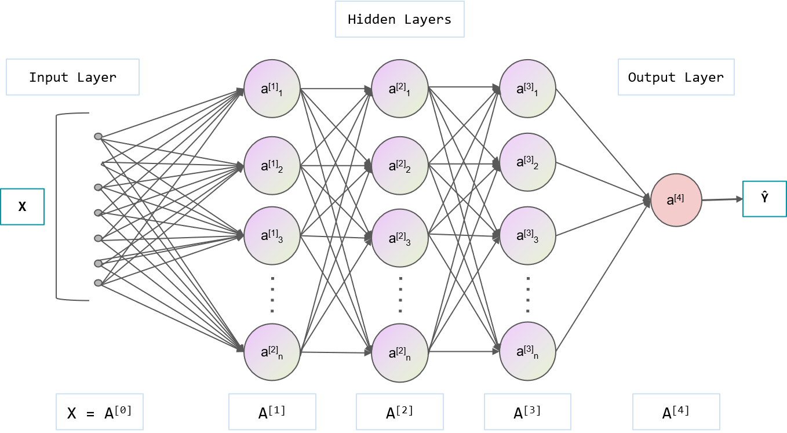

​		其中，$A^{[i]}$代表第i层的神经元向量，$a^{[i]}_j$代表第i层的第j个神经元。在每层中，每个神经元$a^{[i]}_j$都会输出一个实数值，并通过连线传递到下一层的若干个神经元。$a^{[i]}_j$连接到下一层的神经元$a^{[i+1]}_k$的线上 有一个权重$w^{[i+1]}_{jk}$。$a^{[i]}_j$的输出值 乘上$w^{[i+1]}_{jk}$传递到$a^{[i+1]}_k$的输入，实际上$a^{[i+1]}_k$会接收到来自上层的多个神经元的值，$a^{[i+1]}_k$会将这些值全部相加，再加上一个偏置bias $b_k^{[i+1]}$，最终它作为$a^{[i+1]}_k$的输入。
$$
a^{[i+1]}_k(x)=a^{[i+1]}_k(\sum_{j=1}^n w^{[i+1]}_{jk}*a^{[i]}_j + b^{[i+1]}_k)
$$
​		用矩阵表示，记 $A^{[i]} = [a^{[i]}_1,..,a^{[i]}_j,..,a^{[i]}_n]^T,W^{[i]}=(w_{kj})_{n \times n},B^{[i]}=[b^{[i+1]}_1,b^{[i+1]}_2,...,b^{[i+1]}_n]$,则：
$$
A^{[i+1]}(X) = A^{[i+1]}(W^{[i+1]} * A^{[i]} + B^{[i+1]}) \in \R^n
$$
​		那么，令输入层$X=A^{[0]}$,则输出层$A^{[4]}$的输出值就等于：
$$
A^{[4]}(X) = 
A^{[4]}(W^{[4]}*A^{[3]}(W^{[3]}*A^{[2]}(W^{[2]}*A^{[1]}(W^{[1]}*X + B^{[1]}) 
+ B^{[2]}) + B^{[3]})+B^{[4]})
$$
​		记$NN(X;\theta) = A^{[4]}(X;W,B)$,其中$\theta = \{W,B\},\theta$为神经网络NN中所有权重和偏置的集合，也称$\theta$为神经网络的参数，这是常用写法。

​		至此，我们就可以清楚地看到，神经网络就是一个函数。神经网络是 由非线性的激活函数组成的向量函数(层)，通过权重和偏置，一层层地线性复合。

## **1.2 损失函数 Loss**

​		现在我们拥有了神经网络，问题是如何让神经网络完成各种各样的任务？机器学习学的是什么？训练？

​		以分类猫狗照片为例子。假设有一堆数据 Train_Picture=(X,Y)。X是动物的照片，Y是表示该动物是 Dog or Cat，不妨令Dog = 0，Cat = 1。而每一张动物图片X，都可以数字化(像素点，RBG)，将X作为神经网络NN的Inputs，我们得到一个输出值$\hat{Y} = NN(X;\theta)$.

​		设定：如果$\hat{Y}<0.5$认为神经网络判断X是狗，如果$\hat{Y}>0.5$认为神经网络判断X是猫。

​		令损失函数 loss 等于：
$$
loss(\theta) = \sum_{i=1}^n (NN(X_i;\theta)- Y_i)^2 = \sum_{i=1}^n(\hat{Y_i}-Y_i)^2
$$
​		其中，$X_i$代表第i张照片，$Y_i$代表$X_i$是Dog or Cat( =0 or =1)，n代表数据集大小。

​		我们想要做得就是令$\hat{Y_i}$尽可能接近$Y_i$,当然只有一个数据满足是不够的，我们需要一堆数据输入到NN中，输出的结果尽可能都正确。那么，公式(7)提供的loss函数描述了若干张照片的真解和NN预测的解之间的差距，应该想办法调整$\theta$(神经网络中参数)，让loss尽可能小。

​		从数学的角度看，让神经网络能够识别图像，本质上是让神经网络找到图像与类别之间的函数关系。

​		32x32x3的一张狗的照片对应一个3072维的向量X，X通过某个函数$f^\star$映射到数字0(0是人为规定的)。那么，神经网络就是在做一个3072维的函数拟合,我们想要找到$f$,使得$f,f^\star$在某种意义很接近。

​		从这个意义上将，神经网络是一种强大的函数逼近器(成功案例太多)。鄂维南院士在2022年7月的国际数学家大会（International Congress of Mathematicians，ICM）展开报告，讨论数学家视角下的机器学习，从理论层面介绍了单隐藏的神经网络能够逼近的函数族"barron空间"等相关理论证明，他认为Machine Learning 打开了数学高维分析的研究领域，Machine Learning就是数学。

## **1.3 训练以及优化器**

​		从数学视角来看，训练神经网络 = 最优化过程。目标函数就是$loss(\theta)$，训练过程=最小化$loss(\theta)$

​		得益于软件与硬件的发展，软件方面主要是自动微分技术(AD)。通常，自动微分技术AD用于训练过程中求损失函数$loss(\theta)$ 关于$\theta$的导数。如今，训练神经网络的方法基于梯度下降的思想。回想一下Taylor一阶展开，利用一阶导数，取一个小的步长，能够让目标函数值下降。

## 1.4 优化算法

​		梯度下降算法是一种有效的训练神经网络的方式，在最优化领域梯度下降也是最基本的方法，所谓的训练神经网络就是最优化loss函数。
​		现在的各种优化算法如Adam、RMSprop等等，都是基于梯度下降的算法。
​		然而，标准的梯度下降法要求的计算量是很大的，需要对它进行优化，用更少的计算实现差不多的效果。优化梯度下降法有两个思路：优化神经网络结构和优化梯度下降法本身。

### 1.4.1 减少计算量

- **随机梯度下降法**

以交叉熵计算损失函数为例,$loss=- \sum_{i=1}^n(y_i*\log_2 \hat{y_i} + (1-y_i)*\log_2(1-\hat{y_i}))$，其中n代表训练样本数量，训练集的数量很大，每次训练如果把所有样本都计算一遍的计算量太大了。

优化思路：

1. 减少每次训练计算量
2. 优化下降的路径，更少的步数更快地达到极值点

随机梯度下降法：
从期望的角度理解损失函数，$loss=\frac{- \sum_{i=1}^n(y_i*\log_2 \hat{y_i} + (1-y_i)*\log_2(1-\hat{y_i}))}{N}$。随机调一个数据，用这个数据计算梯度， 修改参数值，下次训练时，再随机挑一个数据....

随机梯度下降法的收敛性： 凸问题: $f(x^{(k)})-f^*= O(\frac{1}{\sqrt k}),k代表迭代次数，f^*代表极值点$

- **Mini-batch方法**

mini-batch是现在的随机梯度下降法的别称，每次不止挑一个数据训练，而是挑一个batch_size的数据量训练。

### 1.4.2 优化下降路径

严格来说，用一阶taylor展开，梯度指向的是上升最快的方向，负梯度才是下降最快的方向。而负梯度是某一个点的下降最快的方向，如果想要把整个下降最优的路径也描绘出来，每次迭代的步长要无线小才行。故，每次迭代有一个确定的步长，而有了这个步长，那么下降路径一定不会跟最优的下降路线完全重合。

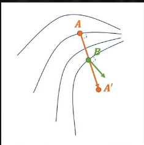

如上图所示，如果每一个下降的步长太长，它可能偏离最优的路径。学习步长由学习率决定。A->A'经过B点，而B点的最速下降方向已经不是AA'了。

如何保证在一定的学习步长，同时又较好地贴近最优路径呢？

- **Newton法**

梯度下降法实际上是一阶泰勒展开，如果步长太大，偏差会较大。而Newton法使用二阶泰勒展开逼近，二次函数有顶点(最小值点)，当学习步长取当前x到该顶点的$\Delta x$时训练效果最好，一旦过了该顶点，近似效果可能还不如一阶导。在一维的情况下，这是很明显的，如图所示。牛顿法的学习步长是确定的。

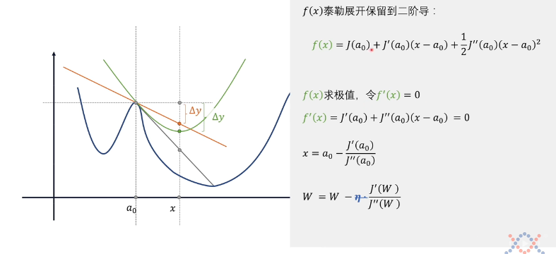

对于多个自变量的情况，标准的Newton法每次要算二阶导的黑塞矩阵，计算上难以接受。尽管如此，牛顿法能给了我们优化思路。因为牛顿法本质是把下降路径的所有维度放在一起，统一考虑(黑塞矩阵，所有维度的2阶导信息)，寻找更好的路径。

将下降路径的维度拆分开，一个一个维度考虑。

- **动量法(冲量法)**

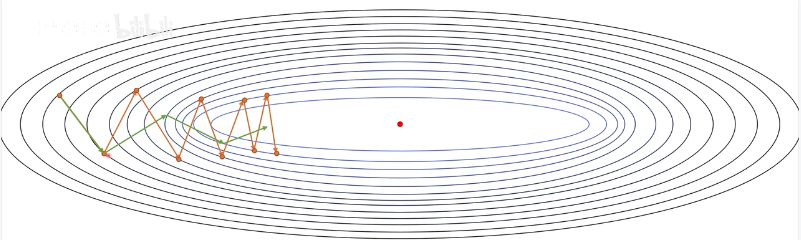

如图所示，橙色的路径振荡地趋于极值点，振荡是我们不太想看到的。如果把下降方向拆分成 横轴和纵轴的分量，发现振荡的原因就纵轴的分量不断正负变化，横轴分量是一直指向极值点的。而绿色的路径，纵轴上的振荡减小，横轴上跨度又增加。

如何做得这一点的？利用历史的梯度修正。将图中橙色路径上一步的梯度和当前步的梯度相加，那么由于纵轴分量方向相反抵消，横轴分量方向相同，那么相加后的方向就是图中绿色路径的方向。

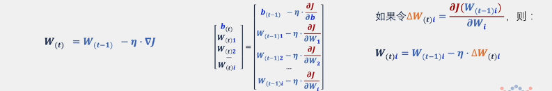

$V_{(t)}$是递归定义，$V_{(t)}$等于上一步的$V_{(t-1)}$+当前步的梯度$\Delta W_{(t)i} \ 它表示第t步，第i个变量W_i的梯度$。

这种定义的一个问题是，如果步数够多，所有历史数据将一视同仁全部考虑。
我们可以对V做一个 `指数加权移动平均法`，使得越近的历史数据权重越大，越远的数据权重越小(趋于0)。

$V_{(t)} = \beta * V_{(t-1)} + (1-\beta)*\Delta W_{(t)i}$

- **Nesterov方法**

不止考虑历史数据，还能超前的考虑"未来"的数据。

    
    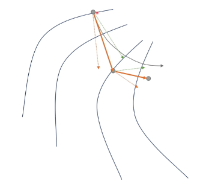

上图中，绿色虚线代表历史冲量，红色虚线代表梯度方向，红色实线代表下降方向。结合这两幅图可以发现，优化路径是有曲折的，向外移动一些，绕了一点远路。

那么，从左图开始，能否通过调整下降方向直接往里偏移？Nesterov方法。

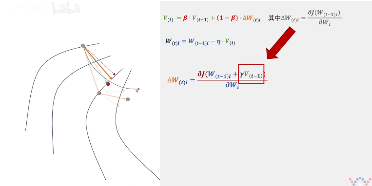

如上图所示，Nesterov方法对当前步的“梯度”做了调整(大红箭头)。

在冲量法中，计算每步的下降方向，需要先计算当前点的梯度值，再调整$V_{(t-1)}->V_{(t)}$。而Nesterov方法，在第t步中，直接将上一步的冲量$V_{(t-1)}$作为下降方法，计算一个“临时的”$W_{(t)i}=W_{(t-1)i}+\gamma *V_{(t-1)}$(这就是所谓的超前“考虑”未来的数据)。

对这个“临时的”$W_{(t)i}$求偏导，得到第t步的“梯度”$\Delta W_{(t)i}$（已经不是原来意义上的梯度了）。然后在修正$V_{(t-1)}->V_{(t)}$，求得下一步的W。

Nesterov方法中的“梯度”$\Delta W_{(t)i}$就是上图中紫色的虚线，它实际上就是绿色虚线箭头指向的点的梯度向量，平移到上面。

- **AdaGrad方法**

学习率应该随着优化过程减少。如果学习率固定不变，很可能由于无法恰好达到极值点，在极值点附近振荡。最简单的方法，每次迭代学习减少固定数值，但减少的数值是人为给定的。如果设定很大，可能还没达到极值点，学习率就为0，停止训练。如果设定得太小，可能已经到达极值点了，还要振荡很久才会停止，浪费计算。

**如何让学习率自动调整？** 也是基于历史数据。

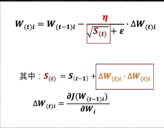

上图中，$S_{(t)}$根据历史数据的变化量而定，当历史数据修正的越多，$S_{(t)}$就更大，从而学习率$\frac{\eta}{\sqrt S_{(t)}+\epsilon}$减少的就越多。

梯度的内积开方，学习到的梯度是真实梯度除以梯度内积的开方。adagrad本质是解决各方向导数数值量级的不一致而将梯度数值归一化。

AdaGrad中自适应学习率的结果和牛顿法中对hessian矩阵做normal approximation是类似的（除了多了开根号）。设J为梯度阵，容易证明JJ^T是对称半正定的矩阵（加和更是如此），为使数值稳定加上了一个轻微扰动。

AdaGrad方法其实不止可以让学习过程最终停下来，更可以调整不同维度上梯度数量级不一致的问题。

如下图所示，紫色的线代表冲量法，灰色的线代表AdaGrad方法。由于在初始点，纵向的梯度更大，紫色线(冲量法)沿着纵向疯狂移动。而AdaGrad方法做了学习率中不同维度数量级的调整($\eta 是一个向量$)，沿着灰色线移动。

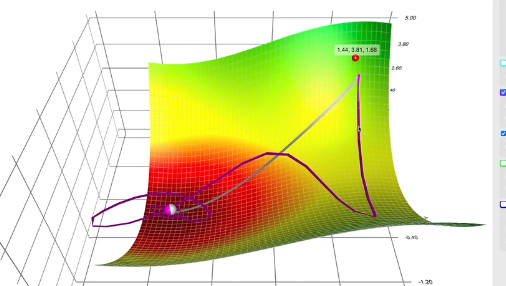

AdaGrad方法可以做优化，不要把所有的历史包袱都考虑进来，只考虑比较当前比较近的部分历史。

做法还是 `指数加权移动平均法`，不再赘述。

优化过后AdaGrad的算法称为 `RMSprop方法`。

- **Adam和Nadam方法**

AdaGrad(RMSprop)方法只考虑修正学习率，实际上可以把AdaGrad方法和动量法结合起来，因为动量法只考虑修正了下降方向。

这个结合的算法就是Adam算法。

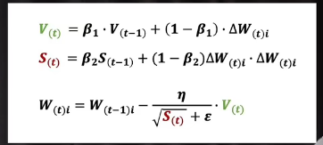

而AdaGrad(RMSprop) 与 Nesterov结合就是 Nadam方法。

[随机梯度下降、牛顿法、动量法、Nesterov、AdaGrad、RMSprop、Adam、Nadam](https://www.bilibili.com/video/BV1r64y1s7fU)

# 2.Physcis-Informed Neural Networks

​		近年来Deep Learning在很多应用场景下取得了非凡的成功，然而，它在求解PDEs的应用在近几年才开始时出现。我们首先给出PINNs(physics-informed neural networks)的一个总览。

​		PINNs 中文译名为 物理信息内嵌的神经网络。PINNs是将PDE方程利用自动微分技术"嵌入"神经网络的损失函数loss中，对模型进行训练。PINNs的算法框架很simple，并且它可以应用到不同类型的PDEs中，例如：integro-differential equations,fractional PDEs, and stochastic PDEs。更进一步，从应用角度看，PINNs求解PDEs的反问题与正问题是同样简单的。

## 2.1 PINNs思想与算法框架

考虑如下带参数$\lambda$的PDE方程，对应的解为$u(\mathrm{x})$ with $\mathrm{x}=\left(x_{1}, \ldots, x_{d}\right)$ defined on a domain $\Omega \subset \mathbb{R}^{d}$ :
$$
f\left(\mathbf{x} ; \frac{\partial u}{\partial x_{1}}, \ldots, \frac{\partial u}{\partial x_{d}} ; \frac{\partial^{2} u}{\partial x_{1} \partial x_{1}}, \ldots, \frac{\partial^{2} u}{\partial x_{1} \partial x_{d}} ; \ldots ; \boldsymbol{\lambda}\right)=0, \quad \mathbf{x} \in \Omega,
$$
边界条件：
$$
\mathcal{B}(u, \mathrm{x})=0 \quad \text { on } \quad \partial \Omega,
$$
其中，$\mathcal{B}(u, \mathbf{x})$ 可以是狄利克雷，诺伊曼，罗宾，或者周期边界条件。对于时间依赖问题，我们认为时间$t$是$\mathbf{x}$的一个特殊分量，$\Omega$包含时间域。初始条件可以简单地看成是时空域上的一种特殊类型的狄利克雷边界条件。

**PINNs的思想是**：

构建神经网络$\hat{u}$作为真解$u$的近似，通过自动微分技术AD求公式(7)中$\hat{u}$关于$x$的各阶偏导数，如果$\hat{u} = u$，那么$\hat{u}$应该满足公式(7)。故，我们对$\hat{u}$求公式(7)中需要的导数值，计算公式(7)左端项，将它纳入loss函数，最小化它。

使得$\hat{u}$能满足“PDEs”。

    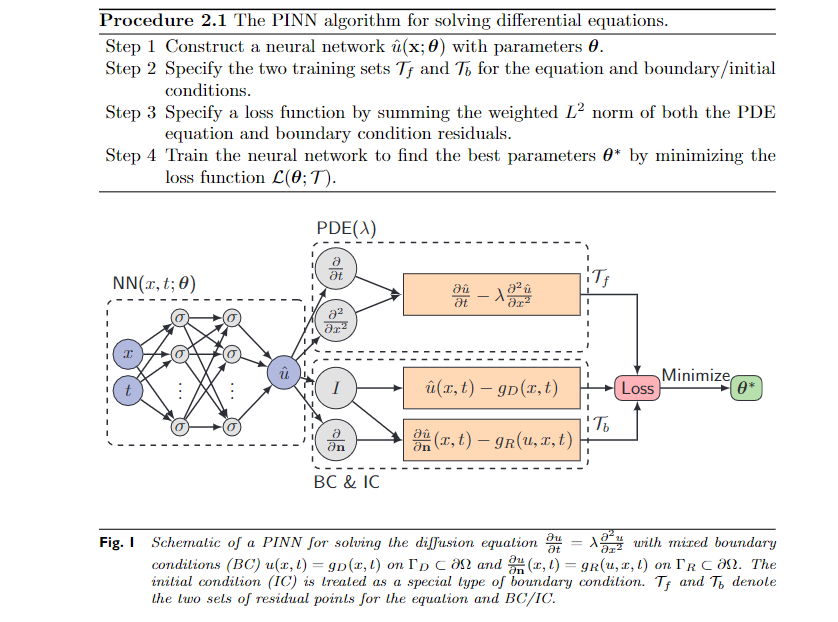

PINNs的算法流程图如**Procedure** $2.1$所示，**Fig.1** 是使用PINNs求解扩散方程的示意图。
$$
\frac{\partial u}{\partial t}=\lambda \frac{\partial^{2} u}{\partial x^{2}}\\
$$
**With mixed boundary conditions:**
$$
u(x, t)=g_{D}(x, t) \quad on \  \Gamma_{D} \subset \partial \Omega \\
\frac{\partial u}{\partial \mathbf{n}}(x, t)=g_{R}(u, x, t) 
\quad on  \ \Gamma_{R} \subset \partial \Omega.
$$

---

**下面，解释算法步骤：**

**第一步**，我们构造一个神经网络 $\hat{u}(\mathbf{x} ; \boldsymbol{\theta})$ ，Input为x，输出与$u$相同维数的向量。其中，$\boldsymbol{\theta}=\left\{\boldsymbol{W}^{\ell}, \boldsymbol{b}^{\ell}\right\}_{1 \leq \ell \leq L}$ 是神经网络$\hat{u}$中的参数。

**第二步**，我们需要通过约束神经网络$\hat{u}$以满足PDEs和边界条件。实际上，我们只是在求解区域内部分点上约束$\hat{u}$，例如：随机地取一些域内分散的点，training data $\mathcal{T}=\left\{\mathrm{x}_{1}, \mathrm{x}_{2}, \ldots, \mathrm{x}_{|\mathcal{T}|}\right\}$。除此之外，$\mathcal{T}$ 包含两个集合, $\mathcal{T}_{f} \subset \Omega$ and $\mathcal{T}_{b} \subset \partial \Omega$, 分别表示域内部的点和边界上的点。 我们将 $\mathcal{T}_{f}$ and $\mathcal{T}_{b}$ 称为残差点。

**第三步**，为了测量神经网络$\hat{u}$与约束之间的差异，我们考虑损失函数定义为方程和边界条件残差$L^{2}$范数的和:
$$
\mathcal{L}(\boldsymbol{\theta} ; \mathcal{T})= \mathcal{L}_{f}\left(\boldsymbol{\theta} ; \mathcal{T}_{f}\right)+\mathcal{L}_{b}\left(\boldsymbol{\theta} ; \mathcal{T}_{b}\right)
$$
其中：
$$
\begin{aligned}
\mathcal{L}_{f}\left(\boldsymbol{\theta} ; \mathcal{T}_{f}\right) &=\frac{1}{\left|\mathcal{T}_{f}\right|} \sum_{\mathbf{x} \in \mathcal{T}_{f}}\left\|f\left(\mathbf{x} ; \frac{\partial \hat{u}}{\partial x_{1}}, \ldots, \frac{\partial \hat{u}}{\partial x_{d}} ; \frac{\partial^{2} \hat{u}}{\partial x_{1} \partial x_{1}}, \ldots, \frac{\partial^{2} \hat{u}}{\partial x_{1} \partial x_{d}} ; \ldots ; \boldsymbol{\lambda}\right)\right\|_{2}^{2} \\
\mathcal{L}_{b}\left(\boldsymbol{\theta} ; \mathcal{T}_{b}\right) &=\frac{1}{\left|\mathcal{T}_{b}\right|} \sum_{\mathbf{x} \in \mathcal{T}_{b}}\|\mathcal{B}(\hat{u}, \mathbf{x})\|_{2}^{2}
\end{aligned}
$$

**最后一步**，我们最小化$\mathcal{L}(\boldsymbol{\theta} ; \mathcal{T})$，这一步在深度学习中被称为"训练/Training"。考虑到$\mathcal{L}(\boldsymbol{\theta} ; \mathcal{T})$是高度非线性以及非凸的，一般可采用Adam和L-BFGS这类梯度下降法。从实验经验来说，L-BFGS对于光滑函数的迭代次数比Adam迭代次数少，因为L-BFGS是拟牛顿方法，用到二阶导信息，而Adam只依赖于一阶导信息。但对于刚性解，L-BFGS可能收敛到一个局部bad solution。

---

​		在实际操作过程中，往往边界条件不容易满足。上述的PINNs算法将边值条件通过$\mathcal{L}(\boldsymbol{\theta} ; \mathcal{T})$进行“软约束”，这对于任何的初边值条件都是适用的。但对于一些简单的情况，我们可以修改解的结构。例如：当边界条件是$u(0)=u(1)=0 \ with\  \Omega  = [0,1]$, 我们可以简单地令近似解为 $\hat{u}(x) =x(x - 1)NN(x) $，这样可以自动地满足边界条件，其中$NN(x)$是一个神经网络。

下面给出PINNs求解Burges方程的算例，展现一下PINNs的威力。
$$
\frac{\partial u}{\partial t} + \frac{\partial u}{\partial x} - \mu \frac{\partial^{2} u}{\partial x^{2}} = 0, \ x \in [-1,1], \ t \in [0,1]\\
u(−1, t) = u(1, t) = 0; u(x,0) = -\sin(\pi*x)
$$
取 $\mu = 0.01/\pi$，使用matlab求得数值解。

- 网络结构为：

  layers = [2,20,20,20,20,20,20,20,20,1]  8 hidden Dense layers，

- 训练集  $|\mathcal{T_f}|=5000,|\mathcal{T_b}|=200$.

- 训练策略：

  Adam训练1000次后，L-BFGS训练500次，25600个测试点，batch=5。

- 训练结果

  $error\_rate = \frac{np.linalg.norm((u-\hat{u}),2)}{np.linalg.norm(u,2) }=0.00258$ 。

    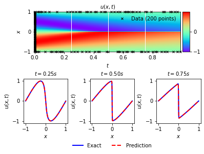

> 代码见我的github仓库。

## 2.2 cPINNs

​		耦合PDEs通常指多区域多物理模型，这些物理模型中的量在交接处相互影响，并在交界处有特定的PDE。例如石油勘探与开采中，涉及到与空腔、多孔岩层、地下水耦合等复杂情况，需要建立能够描述这些耦合现象的模型；农业灌溉工程中会涉及到水流与泥土的耦合作用；研究药物在血液中的动力学也会涉及到血液与生物组织之间的耦合交互，这可以抽象为自由流动的血液与多孔介质组织的耦合模型。

cPINNs(coupled-PINNs)是用于求解耦合PDEs方程组的PINNs模型，在单个PINNs的基础上进行了扩展。

下面以2D-parabolic耦合PDE方程组为例，描述cPINNs的结构和算法。

​		In this work, a simplified model of diffusion through two adjacent materials which are coupled across their shared and rigid interface $I$ through a jump condition is considered. This problem captures some of the time-stepping difficulties of the ocean-atmosphere problem described in 1.2. The domain consists of two subdomains $\Omega_{1}$ and $\Omega_{2}$ coupled across an interface $I$ (example in Figure $1.1$ below). The problem is: given $\nu_{i}>0, f_{i}:[0, T] \rightarrow H^{1}\left(\Omega_{i}\right), u_{i}(0) \in$ $H^{1}\left(\Omega_{i}\right)$ and $\kappa \in \mathbb{R}$, find (for $\left.i=1,2\right) u_{i}: \bar{\Omega}_{i} \times[0, T] \rightarrow \mathbb{R}$ satisfying

$$
\begin{aligned}
u_{i, t}-\nu_{i} \Delta u_{i} &=f_{i}, \quad \text { in } \Omega_{i}, &(1.1)\\
-\nu_{i} \nabla u_{i} \cdot \hat{n}_{i} &=\kappa\left(u_{i}-u_{j}\right), \quad \text { on } I, \quad i, j=1,2, i \neq j, &(1.2)\\
u_{i}(x, 0) &=u_{i}^{0}(x), \quad \text { in } \Omega_{i}, &(1.3)\\
u_{i} &=g_{i}, \quad \text { on } \Gamma_{i}=\partial \Omega_{i} \backslash I . &(1.4)
\end{aligned}
$$

    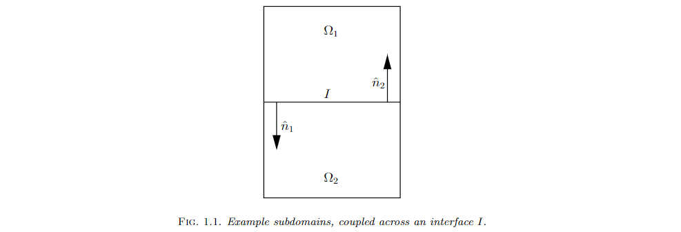

​		可以看到公式(1.2)描述了两个不同区域的物理模型$u_1和u_2$在交接处$I$的相互作用。其余的公式(1.1),(1.3),(1.4)描述了$u_i$在$\Omega_i$内的PDE以及边界处(除了$I$)和初值条件的方程。

cPINNs本质上是两个独立的PINNs通过交界处$I$的PDE 将loss "耦合" 一起,进而同时训练这两个独立的PINNs

其网络结构图如下：

    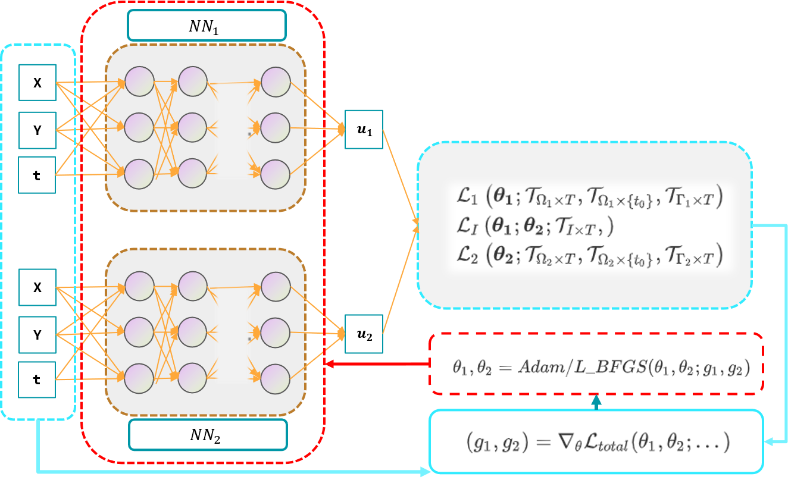

**cPINNs算法步骤与PINNs类似。**

需要额外说明的是：

- cPINNs构造两个(甚至多个)独立的神经网络，上图中为$NN_1和NN_2$
- 除了交界处$I$的训练集相同外，传入$NN_1和NN_2$的训练数据都不同，因为$u1和u2$的区域不同。

## 2.3 self-adaptive-weighted-cPINNs

​		在**2.3**中，我首先会使用cPINNs求解一个2D-parabolic算例。在这之后，提出一种改进的 **self-adaptive-weighted-cPINNs**，使用3D-parabolic算例进行对比，同时也展现PINNs对维数不同问题求解的"一致性"。

### 2D算例

Assume $\Omega_{1}=[0,1] \times[0,1]$ and $\Omega_{2}=[0,1] \times[-1,0]$, so $I$ is the portion of the $x$-axis from 0 to 1 . Then $\mathbf{n}_{1}=[0,-1]^{T}$ and $\mathbf{n}_{2}=[0,1]^{T}$. For $a, \nu_{1}, \nu_{2}$, and $\kappa$ all arbitrary positive constants, the right hand side function $\mathbf{f}$ is chosen to ensure that

$$
\begin{aligned}
&u_{1}(t, x, y)=a x(1-x)(1-y) e^{-t} \\
&u_{2}(t, x, y)=a x(1-x)\left(c_{1}+c_{2} y+c_{3} y^{2}\right) e^{-t} .
\end{aligned}
$$

The constants $c_{1}, c_{2}, c_{3}$ are determined from the interface conditions (1.2) and the boundary conditions for $u_{2}$. One may verify that with the following choices for $c_{1}, c_{2}, c_{3}, u_{1}$ and $u_{2}$ will satisfy (1.1)-(1.4) with $g_{1}=g_{2}=0$, i. e. when $x \in\{0,1\}$ or $y \in\{-1,1\}$ :

$$
c_{1}=1+\frac{\nu_{1}}{\kappa}, c_{2}=\frac{-\nu_{1}}{\nu_{2}}, c_{3}=c_{2}-c_{1} .
$$

- Test Problem : $a=\nu_{1}=\nu_{2}=\kappa=1$.

<figure class="half">
    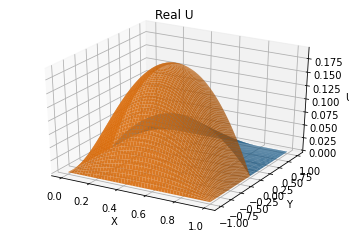,
    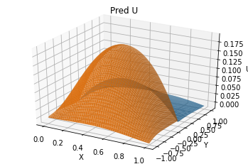
</figure>

> 上图中，蓝色曲面代表$u1(x,y,t=1)$，橙色曲面代表$u2(x,y,t=1)$。左图为真解，右图为cPINNs的解。

**Configuration：**

- 网络结构为：

  layers = [3,20,20,20,20,1]  4 hidden Dense layers，

- 训练集  $|\mathcal{T}_f^{NN_1}|=|\mathcal{T}_f^{NN_2}|=2000,|\mathcal{T}_b^{NN_1}|=|\mathcal{T}_b^{NN_1}|=500,|\mathcal{T}_I|=500$.

- 训练策略：

  **预训练：单区域Adam训练1000次后**，耦合Adam训练1500次，batch=10。

- 训练结果

  $Test Error For u1:  0.06296$

  $Test Error For u2:  0.02420$

注意到：我在训练策略中新增**预训练**步骤，小技巧，让两个神经网络分别单独地进行训练(除去交界处$I$的训练数据)，目的是上神经网络初步成型后，再把重心放在交界处$I$，试图增加一些训练效率。因为与单PINNs相比，cPINNs的训练数据集只有交界处$I$需要共同训练，而$I$本身也只是一条边界，相当于单PINNs的训练集中少了一条边界的训练集，故在模型训练初期进行一些单区域的训练epoches可能不会影响最后的效果，反而有减少计算量并快速地靠近极值点的效果。

---

### **自适应权重的cPINNs**

​		self-adpative-weighted-cPINNs我称之为**自适应权重的cPINNs**。提出这一想法的原因是，在cPINNs训练过程中，交接处$I$将两个神经网络耦合在一起，而它们的loss之间可能存在的差距很大。想法是，训练过程中能偏向于loss较大的一方，提高训练效率。

**自适应loss函数因子：**
$$
Loss = \alpha_1 * loss_{u1} + \alpha_2 * loss_{u2} \\
loss_{u1} := loss_{u1}^{bc} + loss_{u1}^{f} + loss_{u1}^{i} \\
loss_{u2} := loss_{u2}^{bc} + loss_{u2}^{f} + loss_{u2}^{i} \\
$$

其中$\alpha_i$就是自适应因子。

考虑到实际训练过程中，u1和u2的loss大小不一样，**”优先“**训练loss较大的一方，即在$loss_{ui}$前乘上一个较大的因子，使其在整个**$Loss$**中占比更大，从而达到优先训练的目的。

如果我们把$\alpha_1,\alpha_2$也看做变量。在训练模型参数的过程中，我们使用的梯度下降算法，是基于“负梯度”。

如果使用**“正梯度”**去改变$\alpha_1,\alpha_2$，能够使得$loss_{ui}$对应的$\alpha_{i}$更大。

实际上，使用这种策略，不断地训练会使得$\alpha$一直增大，同时为了控制$\alpha$的值，可以套一层sigmoid函数，使得$\alpha$控制在0-1之间。例如：$初始化\alpha=0，\alpha=tf.math.sigmoid(\alpha)$,

#### 加权策略

对$loss_{u1} 和 loss_{u2}$ 加权的**目的**：使得损失较大的一方在整个loss中的贡献更大，使得神经网络倾向于训练损失更大的一方。

值得注意的是，如果两个神经网络之间没有联系，即$loss_{u1}(x_1;\theta_1) , loss_{u2}(x_2;\theta_2) $的自变量$(x_1,\theta_1),(x_2,\theta_2)$之间没有重合的部分，那么对$loss_{u1} 和 loss_{u2}$ 加权实际上是没有"效果"的。

原因是，如果两个神经网络之间没有联系时，那么我们对$Loss = \alpha_1 * loss_{u1} + \alpha_2 * loss_{u2}$求关于$\theta_{1}$的导数，$\frac{\partial loss}{\partial \theta_1} =\alpha_1 *  \frac{\partial loss_{u1}}{\partial \theta_1}$，可以发现与$\theta_2$无关，即跟第二个神经网络无关，只是在训练单个神经网络而已，而对单个神经网络的loss乘以一个数，实际是没有用的，相当于对优化问题中目标函数乘上一个常数，显然不影响我们寻找最优解。

因此，此处的$loss_{u1},loss_{u2}$具体为：
$$
loss_{u1} := loss_{u1}^{bc} + loss_{u1}^{f} + loss_{u1}^{i} \\
loss_{u2} := loss_{u2}^{bc} + loss_{u2}^{f} + loss_{u2}^{i} \\
$$

其中$loss_{u1}^{i}$是u1在交界处Interface 的损失函数，与u1,u2有关，即与$\theta_{1},\theta_{2}$有关，它使得两个神经网络联系在一起。当$loss_{u1}^{i}$权重更大时，模型通过梯度下降更新两个网络的参数$\theta_{1},\theta_{2}$,会更倾向于使得$loss_{u1}$更小。

在实际操作中，无论是单区域的PINN和耦合的PINN，在边界处的拟合效果相较于内部的拟合效果更差。

往往在$loss_u^{bc}$前乘上一个常数k，比如k=10：

$$
Loss = \alpha_1 * loss_{u1} + \alpha_2 * loss_{u2} \\
loss_{u1} := 10* loss_{u1}^{bc} + loss_{u1}^{f} + loss_{u1}^{i} \\
loss_{u2} := 10* loss_{u2}^{bc} + loss_{u2}^{f} + loss_{u2}^{i} \\
$$

#### 多种自适应加权策略

除了上述自适应权重 Self-Adaptive-Weight之外，我还构造了一种新的。

令:

$$
Loss^{(k)} = loss_{u1}^{(k)} + \alpha^{(k)} loss_{u2}^{(k)} ,\alpha^{(0)} = 1 \\

 \alpha^{(k+1)} = \frac{loss_{u2}^{(k)} }{loss_{u1}^{(k)} + eps}, 其中 eps是一个很小的正数，防止分母为0\\
$$

想法就是，当前步的权重$\alpha^{(k)}$是根据上一步$loss_{u1}^{(k-1)},loss_{u2}^{(k-1)}$的比值来调整,当$\alpha^{(k)}$>1时，表示上一步$loss_{u2}$的值更大，故在当前步，让$loss_{u2}$乘上$a^{(k)}>1$,使得当前步$loss_{u2}$下降得更快。

**这种”自适应“策略有很多，想怎么构造就怎么构造，要抓的点就是根据以前的loss，动态地调整权重，使得当前步倾向训练于前N步中较大的子loss** 。

---

### 3D算例

​		在这一小节中，我使用一个3D-parabolic的算例，对比cPINNs和self-adaptive-weights-cPINNs之间的差异。

Assume $\Omega_{1}=[0,1] \times[0,1] \times[0,1]$ and $\Omega_{2}=[0,1] \times[0,1]\times[-1,0]$, so $I$ is the plain of z=0 , the $x$-axis from 0 to 1 ,the $y$-axis from 0 to 1.Namely.  $I$ = $[0,1] \times[0,1] \times\{0\}$ .

Then $\mathbf{n}_{1}=[0,0,-1]^{T}$ and $\mathbf{n}_{2}=[0,0,1]^{T}$.

For $a, \nu_{1}, \nu_{2}$, and $\kappa$ all arbitrary positive constants, the right hand side function $\mathbf{f}$ is chosen to ensure that

$$
\begin{aligned}
&u_{1}(t, x, y, z)=a xy(1-x)(1-y)(1-z) e^{-t} \\
&u_{2}(t, x, y, z)=a xy(1-x)(1-y)\left(c_{1}+c_{2} z+c_{3} z^{2}\right) e^{-t} .
\end{aligned}
$$

The constants $c_{1}, c_{2}, c_{3}$ are determined from the interface conditions (1.2) and the boundary conditions for $u_{2}$. One may verify that with the following choices for $c_{1}, c_{2}, c_{3}, u_{1}$ and $u_{2}$ will satisfy (1.1)-(1.4) with $g_{1}=g_{2}=0$, i. e. when $(x,y,z) \in\{x=1,0\leq y \leq 1,0\leq z \leq 1\}, u_1(x,y,z,t) = 0$ :

$$
c_{1}=1+\frac{\nu_{1}}{\kappa}, c_{2}=\frac{-\nu_{1}}{\nu_{2}}, c_{3}=c_{2}-c_{1}.
$$

- Test Problem : $a=\nu_{1}=\nu_{2}=\kappa=1$

**Configuration：**

- 网络结构为：

  Layers=[4,40,40,40,40,40,40,40,40,40,1]  8 hidden Dense layers，

- 训练集  $|\mathcal{T}_f^{NN_1}|=|\mathcal{T}_f^{NN_2}|=4000,|\mathcal{T}_b^{NN_1}|=|\mathcal{T}_b^{NN_1}|=500,|\mathcal{T}_I|=200$.

- 训练策略：

  1. 100个epoches内cPINNs和self-adaptive-weights-cPINNs之间的差异

  2. Adam训练2000次后，L-BFGS训练1000次，10000个测试点，batch=10

---

- 下图展示了100个epoches内cPINNs和self-adaptive-weights-cPINNs之间的差异。

    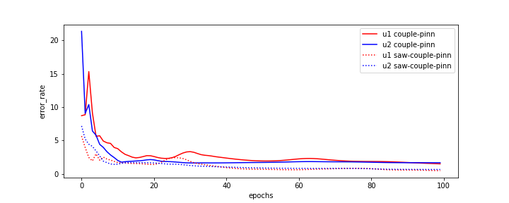,
    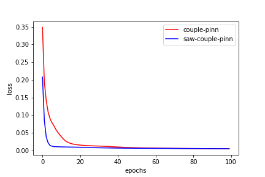,

---

- Adam训练2000次后，L-BFGS训练1000次，10000个测试点，batch=10

下图展示了在T=1，Z=0时u1和u2的曲面图（包括真解和cPINNs解）

    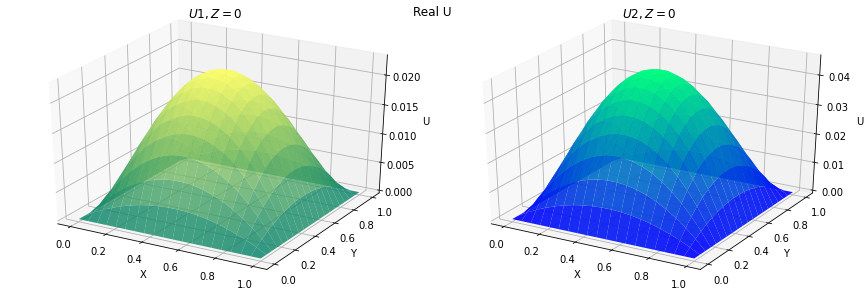
    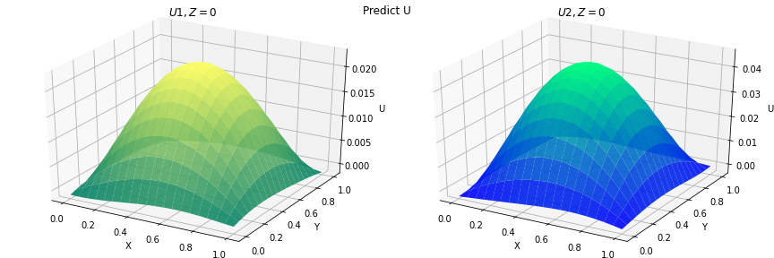

下图展示了在T=1，时u1和u2的3d热力图，粒子颜色深度代表u的值。

    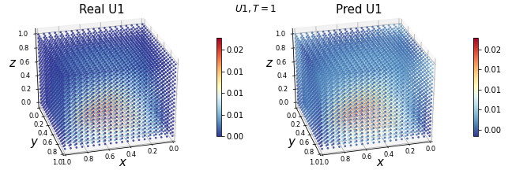
    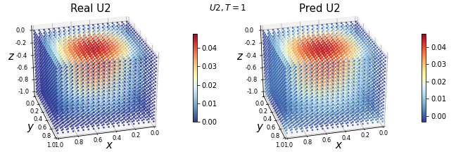

# 3.PINNs求解反问题

# 4. 收敛性与PINNs研究现状

$$
\begin{aligned}&\mathcal{L}_{1}\left(\boldsymbol{\theta_1} ; \mathcal{T}_{\Omega_1 \times T},\mathcal{T}_{\Omega_1 \times \{t_0\}},\mathcal{T}_{\Gamma_1 \times T} \right)\\&\mathcal{L}_{I}\left(\boldsymbol{\theta_1} ; \boldsymbol{\theta_2} ; \mathcal{T}_{I \times T},\right) \\&\mathcal{L}_{2}\left(\boldsymbol{\theta_2} ; \mathcal{T}_{\Omega_2 \times T},\mathcal{T}_{\Omega_2 \times \{t_0\}},\mathcal{T}_{\Gamma_2 \times T} \right) \\\end{aligned}
$$

$(g_{1},g_{2}) = \nabla_{\theta} \mathcal{L}_{total}(\theta_1,\theta_2;...)$

$\theta_1,\theta_2 = Adam/L-BFGS(\theta_1,\theta_2;g_1,g_2)$